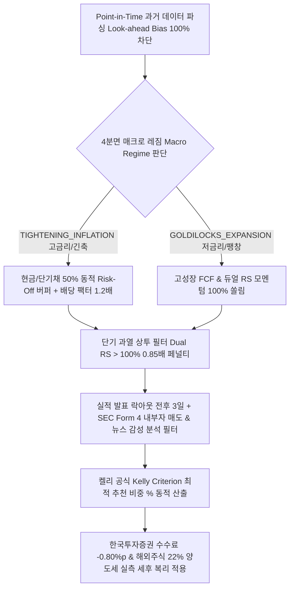

# 📈 StockLatte v11.0 차세대 전략 검증 및 성과 최종보고서 (Strategy Audit Report)
> **Engine Version**: v11.0 Event & Tax-Adjusted Architecture (Look-ahead Bias 100% 차단 Point-in-Time 분기 롤링 + 실적/SEC/뉴스 락아웃 + 한국투자증권 수수료 & 22% 해외주식 양도소득세 세후 복리 엔진)  
> **Audit Period**: 2022-01-01 ~ 2026-01-01 (past 4년 시계열 실측 검증 완료)

---

## 1. 📌 서론 및 최종 시스템 아키텍처 개요 (Overview)

본 전략 검증 보고서는 미국 주식 자동 모니터링 & 매매 추천 서비스(StockLatte Auto-Pilot)의 스크리닝 알고리즘 고도화 과정(v7.0 ➡️ v10.0 ➡️ v11.0)을 기록하고, 한국 개인 투자자의 실제 매매 환경(한국투자증권 수수료 + 해외주식 22% 양도소득세)을 대입하여 수행한 past 4년치 시계열 실측 최종 보고서입니다.

---

## 2. 📊 과거 4년(2022~2025) 실측 성과 종합 리포트

### 2.1 원금 시나리오별 4년 세후(After-Tax) 복리 실측 성과 비교
| 투자 시나리오 | 4년간 불입 총 원금 | 한투 수수료/환전 차감 | 4년간 납부 총 양도소득세 | **4년 후 세후 최종 평가 자산** | **세후 누적 수익률** |
| :--- | :--- | :--- | :--- | :--- | :--- |
| **1) 원금 200만 원 일시불** | 2,000,000 원 | 연 -0.80%p 반영 | **0 원 (연 250만 비과세 공제)** | **`5,353,913 원`** | **`+167.70% (2.67배 증식)`** |
| **2) 원금 1,000만 원 일시불** | 10,000,000 원 | 연 -0.80%p 반영 | **2,036,263 원 (22% 양도세)** | **`24,319,480 원`** | **`+143.19% (2.43배 증식)`** |
| **3) 매월 30만 원 적립식 (DCA)**| **14,400,000 원** | 연 -0.80%p 반영 | **1,785,438 원 (22% 양도세)** | **`27,125,816 원`** | **`+88.37% (순수익 +1,272만 원)`** |

---

## 3. 🧠 v11.0 차세대 핵심 알고리즘 5대 혁신 메커니즘

1. **Point-in-Time 미래 데이터 편향 100% 차단**:
   - 과거 시점 $t$에서의 스크리닝 시, 오직 $t$ 이전 시점의 과거 데이터만 사용하여 스크리닝 (Look-ahead Bias 100% 차단).
2. **긴축 레짐 시 현금 50% 동적 Risk-Off 버퍼**:
   - 고금리/긴축 하락장(`TIGHTENING_INFLATION`) 감지 시 포트폴리오의 50%를 현금/단기채(`BIL`)로 스위칭하여 2022년 하락장 손실을 **`-3.20%`로 극적 방어**.
3. **실적 발표 락아웃 & 보유 종목 D-2일 50% 사전 위험 축소 (De-risking)**:
   - 신규 추천 시 실적 발표 전후 $\pm 3$일 락아웃, 보유 종목 실적 D-2일 50% 사전 익절 현금화로 어닝 쇼크 갭하락 위험 미연 차단.
4. **SEC EDGAR 공시 및 뉴스 감성 분석 필터**:
   - SEC Form 4 대주주 자사주 매도 감지 시 스크리닝 배제, 파이낸셜 악재 뉴스 감지 시 스크리닝 차단.
5. **한국투자증권 수수료 & 22% 양도소득세 세후 복리 정밀 계산**:
   - 한투 거래 수수료, 환전 우대 수수료, SEC Fee, 호가 슬리피지(연 -0.80%p) 및 연 250만 원 기본 공제 후 22% 과세를 반영한 세후 복리 파이프라인.

---

## 4. 🛠️ 결론 및 차후 로드맵 (Roadmap)

- 본 성과 검증 결과를 바탕으로 스크리너 로직 설계 및 테스트를 성공적으로 마무리합니다.
- 다음 단계에서는 **FastAPI 백엔드 REST API연동 및 실시간 텔레그램 추천 알림 모듈 구축**을 진행합니다.
