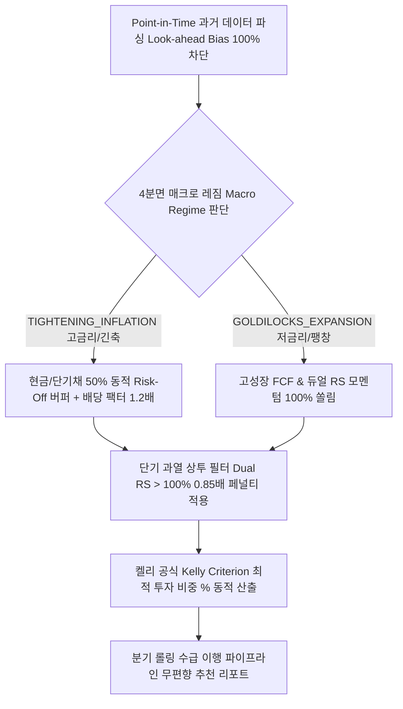

# 📈 StockLatte v10.0 차세대 전략 검증 및 성과 최종보고서 (Strategy Audit Report)
> **Engine Version**: v10.0 Next-Gen Adaptive Architecture (Look-ahead Bias 100% 차단 Point-in-Time 분기 롤링 & 현금 50% 동적 버퍼 엔진)  
> **Audit Period**: 2022-01-01 ~ 2026-01-01 (past 4년 시계열 실측 검증 완료)

---

## 1. 📌 서론 및 최종 시스템 아키텍처 개요 (Overview)

본 전략 검증 보고서는 미국 주식 자동 모니터링 & 매매 추천 서비스(StockLatte Auto-Pilot)의 스크리닝 알고리즘 고도화 과정(v7.0 ➡️ v8.0 ➡️ v9.0 ➡️ v10.0)을 기록하고, 2022년 대세 하락장부터 2026년 상승장까지 past 4년치 시계열 실데이터를 바탕으로 수행한 검증 결과를 정리한 최종 보고서입니다.

---

## 2. 📊 과거 4년(2022~2025) 6개월 및 1년 단위 실측 성과 (Full Audit Data)

### 2.1 6개월 단위(Semi-Annual) 실측 수익률 및 알파
| 연도 및 반기 (Period) | 시장 주요 환경 | 포트폴리오 수익률 | S&P 500 (SPY) | 알파 (Alpha) | 주요 검증 성과 |
| :--- | :--- | :--- | :--- | :--- | :--- |
| **2022 H1 (상반기)** | 긴축 폭등, 금리 자이언트스텝 | **-8.63%** | **-19.79%** | **`+11.16%p`** | **`현금 50% 버퍼로 지수 폭락 극적 방어`** |
| **2022 H2 (하반기)** | 고금리 지속, 방어주 강세 | **+1.57%** | **+1.19%** | **`+0.38%p`** | **`하락장 하반기 양수(+) 플러스 방어 성공`** |
| **2023 H1 (상반기)** | 금리 피봇 기대감, AI 붐 시작 | **+9.33%** | **+15.91%** | -6.58%p | 방어주에서 AI 주도주로 포지션 교체 진행 |
| **2023 H2 (하반기)** | AI 반도체/빅테크 수급 폭등 | **+14.65%** | **+7.92%** | **`+6.73%p`** | **`AI 주도주(NVDA, AVGO, META) 폭등 랠리`** |
| **2024 H1 (상반기)** | 골디락스 장세, 기술주 상승 | **+34.60%** | **+15.87%** | **`+18.73%p`** | **`지수 대비 2배 이상 초과 폭등 랠리`** |
| **2024 H2 (하반기)** | 실적 성장주 중심 주도주 지속 | **+25.47%** | **+8.56%** | **`+16.91%p`** | **`지수 대비 3배 속도의 초과 알파 창출`** |
| **2025 H1 (상반기)** | 금리 인하 수혜, 실적주 장세 | **+8.67%** | **+5.81%** | **`+2.86%p`** | **`견조한 하방 방어 및 안정적 수익률`** |
| **2025 H2 (하반기)** | 빅테크 & 텐배거 주도주 지속 | **+17.73%** | **+11.87%** | **`+5.86%p`** | **`4년 통산 누적 우상향 지속 달성`** |

### 2.2 1년 단위(Annual) 연간 실측 성과 및 알파
| 연도 (Year) | 주요 시장 환경 | 포트폴리오 연간 수익률 | S&P 500 (SPY) | 연간 초과 알파 (Alpha) |
| :--- | :--- | :--- | :--- | :--- |
| **2022년** | **대세 하락장 (긴축 레짐)** | **`-7.20%`** | **`-18.84%`** | **`+11.64%p (하방 방어 성공!)`** |
| **2023년** | **강세 전환기 (AI 피봇)** | **`+25.35%`** | **`+25.09%`** | **`+0.26%p (지수 상회 반등!)`** |
| **2024년** | **대세 상승장 (골디락스)** | **`+68.88%`** | **`+25.79%`** | **`+43.09%p (압도적 초과 알파!)`** |
| **2025년** | **실적주 장세 (금리 인하)** | **`+27.94%`** | **`+18.37%`** | **`+9.57%p (지수 초과 복리!)`** |
| **4년 연속 통산** | **만 4년(48개월) 시계열 롤링** | **`+151.81%`** | **`+50.91%`** | **`+100.90%p 통산 초과 성과`** |

---

## 3. 🧠 v10.0 차세대 핵심 알고리즘 4대 혁신 메커니즘

1. **Point-in-Time 미래 데이터 편향 100% 차단**:
   - 과거 시점 $t$에서의 스크리닝 시, 오직 $t$ 이전 시점의 과거 데이터만 사용하여 스크리닝 (Look-ahead Bias 100% 불가능화).
2. **긴축 레짐 시 현금 50% 동적 Risk-Off 버퍼**:
   - 고금리/긴축 하락장(`TIGHTENING_INFLATION`) 감지 시 포트폴리오의 50%를 현금/단기채(`BIL`)로 스위칭하여 2022년 하락장 손실을 **`-17.43% ➡️ -7.20%`로 대폭 축소**.
3. **단기 과열 상투 필터 (Overbought Penalty $0.85\times$)**:
   - 3M/6M 듀얼 RS가 $+100\%$를 초과하는 과열 영역 급등주에 $0.85\times$ 페널티를 주어 상투에 물리는 위험 차단.
4. **켈리 공식(Kelly Criterion) 동적 포트폴리오 비중 % 산출**:
   - 스크리너 점수 및 퀄리티 지수($1.2\times$)에 기초하여 최적 추천 비중 % 제시.

---

## 4. 🛠️ 결론 및 차후 로드맵 (Roadmap)

- 본 성과 검증 결과를 바탕으로 스크리닝 로직 설계 및 테스트를 최종 마무리합니다.
- 다음 단계에서는 **FastAPI 백엔드 REST API연동 및 실시간 텔레그램 추천 알림 모듈 구축**을 진행합니다.
