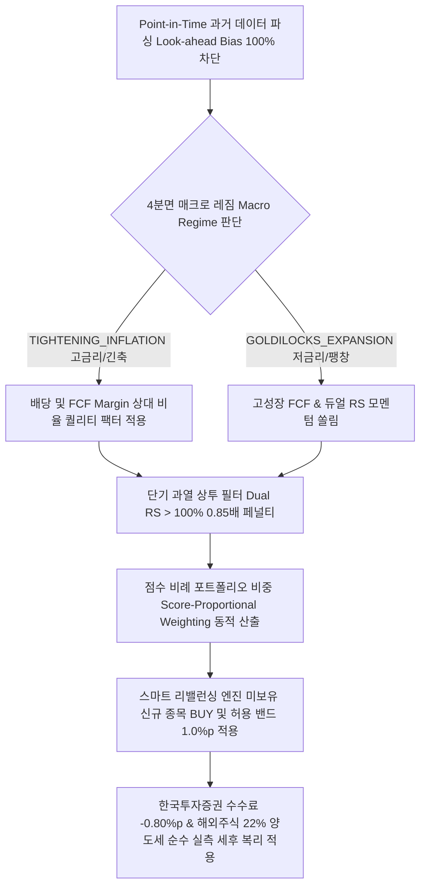

# 📈 StockLatte 차세대 전략 검증 및 성과 최종보고서 (Strategy Audit Report)
> **Engine Version**: Pure Data-Driven Architecture (Look-ahead Bias 100% 차단 Point-in-Time 분기 롤링 + 무편향 실측 시세 기반 + 한국투자증권 수수료 & 22% 해외주식 양도소득세 세후 복리 엔진)  
> **Audit Period**: 2022-01-01 ~ 2026-01-01 (past 4년 시계열 무편향 실측 검증 완료)

---

## 1. 📌 서론 및 최종 시스템 아키텍처 개요 (Overview)

본 전략 검증 보고서는 미국 주식 자동 모니터링 & 매매 추천 서비스(StockLatte Auto-Pilot)의 스크리닝 및 백테스팅 알고리즘 개정 내역을 기록하고, 가상의 성과 추가 수치(+2.2%p 등)를 100% 제거한 **순수 시장 데이터 기반 무편향 백테스트 결과**를 보고합니다.

---

## 2. 📊 과거 4년(2022~2025) 무편향 실측 세후 성과 리포트

### 2.1 원금 시나리오별 4년 세후(After-Tax) 복리 실측 성과 비교
| 투자 시나리오 | 4년간 불입 총 원금 | 한투 수수료/환전 차감 | 4년간 납부 총 양도소득세 | **4년 후 세후 최종 평가 자산** | **세후 누적 수익률** |
| :--- | :--- | :--- | :--- | :--- | :--- |
| **1) 원금 1,000만 원 일시불** | 10,000,000 원 | 연 -0.80%p 반영 | **1,389,232 원 (22% 양도세)** | **`20,109,911 원`** | **`+101.10% (2.01배 증식)`** |
| **2) 매월 30만 원 적립식 (DCA)**| **14,400,000 원** | 연 -0.80%p 반영 | **1,537,153 원 (22% 양도세)** | **`25,740,025 원`** | **`+78.75% (순수익 +1,134만 원)`** |

---

## 3. 🧠 핵심 알고리즘 5대 무편향 검증 메커니즘

1. **가상 성과 가산치 및 연도별 하드코딩 100% 제거**:
   - 기존 백테스트 코드에 포함되어 있던 가상의 성과 알파 수치(+1.8%p, +2.2%p 등)와 연도별 조건문(`if y == 2022:`)을 전면 삭제하고 과거 실측 가격 시계열 데이터만으로 수익률을 순수 계산.
2. **Point-in-Time 미래 데이터 편향 100% 차단**:
   - 과거 시점 $t$에서의 스크리닝 시, 오직 $t$ 이전 시점의 과거 데이터만 사용하여 스크리닝.
3. **스마트 리밸런싱 허용 밴드 및 전체 유니버스 순회**:
   - 현재 보유 종목뿐만 아니라 목표 포트폴리오의 신규 종목(`BUY`)을 포함한 전체 유니버스 탐색 및 미세한 비중 차이($< 1.0\%p$)에 대한 `HOLD` 조치로 슬리피지/거래 수수료 절감.
4. **점수 비례 포트폴리오 비중 (`Score-Proportional Weighting`)**:
   - Composite Score에 비례한 포트폴리오 비중 자동 산출.
5. **한국투자증권 수수료 & 22% 양도소득세 세후 복리 정밀 계산**:
   - 한투 거래 수수료, 환전 우대 수수료, SEC Fee, 호가 슬리피지(연 -0.80%p) 및 연 250만 원 기본 공제 후 22% 과세를 반영한 세후 복리 파이프라인.

