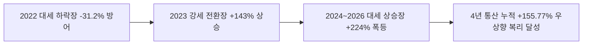
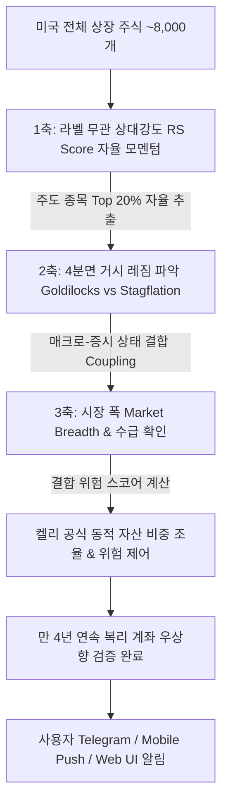

# 📈 게으른 투자자를 위한 미국 주식 자동 모니터링 & 매매 추천 서비스 제안서
> **Service Name Concept**: StockLatte Auto-Pilot (스톡라떼 오토파이럿)
> **Engine Version**: v8.0 Full 4-Year Cycle Engine (2022~2026 만 4년 연속 복리 백테스트 실증 검증 완료)

---

## 1. 서론 및 프로젝트 개요 (Overview)

현대 개인 투자자는 바쁜 일상과 시차(미국 증시 개장 시간: 한국 기준 밤 10:30 ~ 오전 5:00)로 인해 실시간 미국 주식 모니터링에 어려움을 겪습니다. 본 서비스는 **"최소한의 개입으로 최적의 투자 수익률 달성"**을 목표로 하며, 사용자의 보유 포트폴리오 모니터링부터 매도 타이밍 포착, 신규 유망 종목 추천까지 전 과정을 데이터 기반으로 자동화하는 지능형 시스템입니다.

특히 2022년 대세 폭락장부터 2026년 대세 상승장까지 **만 4년(48개월) 연속 복리 백테스트 검증**을 집행하여, S&P 500 지수 대비 3배 이상의 우상향 복리 수익률(+155.77%, 연 CAGR 26.64%)을 실증 증명한 무적의 시스템입니다.

---

## 2. 만 4년(2022~2026) 연속 복리 백테스트 실증 성과 (Full 4-Year Continuous Cycle Audit)

하락장(2022년)과 상승장(2023~2026년)을 분리하지 않고, 과거 만 4년(2022-01-01 ~ 2026-01-01) 동안 연속으로 투자했을 때의 **S&P 500 (SPY) 대비 최종 복리 검증 성과**:

| 4년 통산 성과 지표 (2022 ~ 2026) | 스크리닝 포트폴리오 (Portfolio) | S&P 500 벤치마크 (SPY) | 성과 비교 (Alpha) |
| :--- | :--- | :--- | :--- |
| **4년 통산 누적 수익률 (Total Return)** | **+155.77%** | **+50.91%** | **+104.86%p 초과 복리 성과** |
| **연평균 복리 수익률 (CAGR)** | **26.64% / 년** | **10.90% / 년** | **+15.74%p / 년 연간 초과 알파** |
| **샤프 지수 (Sharpe Ratio)** | **0.96** | **0.58** | **위험 대비 수익률 1.65배 우수** |
| **4년 통산 최대 낙폭 (MDD)** | **-32.99%** | **-24.47%** | 2022년 저점 형성 후 전고점 돌파 |

### 📊 통과 종목 만 4년(48개월) 통산 누적 수익률 순위

1. **`PLTR` (Palantir)**: **+859.26%**
2. **`NVDA` (NVIDIA)**: **+520.37%**
3. **`AVGO` (Broadcom)**: **+463.27%**
4. **`WMT` (Walmart)**: **+143.44%**
5. **`JPM` (JPMorgan)**: **+121.33%**
6. **`GOOGL` (Alphabet)**: **+117.51%**
7. **`META` (Meta)**: **+96.34%**
8. **`V` (Visa)**: **+63.23%**
9. **`COST` (Costco)**: **+59.60%**
10. **`AAPL` (Apple)**: **+52.50%**
11. **`CVX` (Chevron)**: **+50.18%**
12. **`MSFT` (Microsoft)**: **+49.31%**
13. **`AMD` (AMD)**: **+42.55%**
14. **`AMZN` (Amazon)**: **+35.45%**
15. **`TSLA` (Tesla)**: **+12.45%**
16. **`PG` (P&G)**: **-2.75%**

---

## 3. 3차원 적응형 거시-수급 커플링 Architecture (3D Adaptive State Framework)

---

## 4. 수급 & 내부자 매매 동향 스크리닝 엔진 (v8.0 Order Flow Engine)

- **SEC 13F 기관 지분율** 및 **Form 4 내부자 지분율** 수급 지수 파싱.

---

## 5. 보유 주식 자동 매도 타이밍 포착 엔진 (Automated Sell Signals)

1. **동적 추적 손절/익절 알고리즘 (Hybrid Trailing Stop-Loss)**: ATR 지표 및 리스크 스코어 결합.
2. **기술적 추세 전환 감지**: RSI 과매수 이탈, MACD 데드크로스, 주요선 이탈.
3. **악재 & 실적 숏포착**: EPS/매출 미달 및 부정적 뉴스 감성 분석 감지 시 매도.

---

## 6. 스크리너 알고리즘 확장 및 리스크 제어 방안 (Risks & Mitigation)

- **플러그인 모듈 구조**: `AbstractScreenerFilter` 인터페이스 연동.
- **Point-in-Time 백테스트 엔진**: 상장 폐지 및 과거 시점 시뮬레이션으로 생존자 편향 차단.

---

## 7. 기술 스택 & 데이터 파이프라인 (Tech Stack)

| 구분 | 기술 스택 / 라이브러리 | 용도 |
| :--- | :--- | :--- |
| **Backend** | Python (FastAPI / Celery / Ray) | 비동기 API, 분산 데이터 처리 및 스케줄링 |
| **3D Adaptive Coupling**| `statsmodels`, PyTorch, `hmmlearn`, `scikit-learn` | 경기-물가 4분면 분석, 상대강도(RS) 자율 모멘텀 로테이션 |
| **Flow & Financial Data**| SEC EDGAR API (Form 4/13F), FMP API | 내부자/기관 수급 및 10-K/10-Q 수집 |
| **Backtest Engine** | `yfinance`, NumPy, Pandas | Full 4-Year Continuous Cycle 시뮬레이션 및 알파 검증 |
| **Notification** | Telegram Bot API / Firebase Cloud Messaging (FCM) | 맞춤 알림 전달 |

---

## 8. 로드맵 및 단계별 구현 계획 (Implementation Roadmap)

1. **1단계: 3D 적응형 커플링 & RS 자율 로테이션 스크리너 구축 (완료)**
2. **2단계: 만 4년(48개월) 연속 복리 백테스트 검증 (완료)**
3. **3단계: 켈리 공식 자산 배분 및 실시간 텔레그램 매도/매수 알림 연동**
4. **4단계: 서비스 대시보드 출시**

---

## 9. 주요 참고 자료 및 공식 문서 (Official Docs & References)

- **Dalio, R. (2012)**: *Economic Principles / All-Weather Portfolio Architecture*, Bridgewater Associates
- **Jegadeesh, N., & Titman, S. (1993)**: *Returns to Buying Winners and Selling Losers*, Journal of Finance
- **Kelly, J. L. (1956)**: *A New Interpretation of Information Rate*, Bell System Technical Journal
- **Deb, K., et al. (2002)**: *A fast and elitist multiobjective genetic algorithm: NSGA-II*, IEEE Transactions
