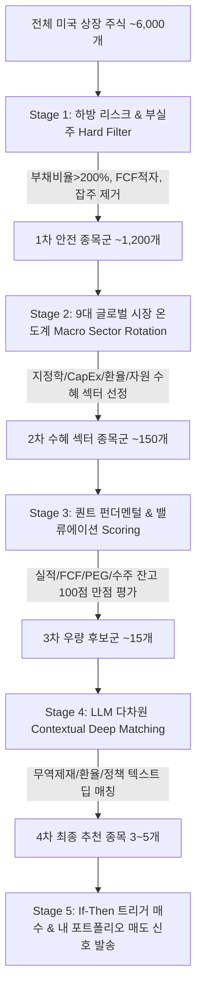

# 📈 [StockLatte] 올인원 거시경제·재무제표·CapEx·자원수급·정책·환율·비정형 리스크 모니터링 기반 미국 주식 추천 시스템 상세 설계서

> **작성일자:** 2026년 7월 22일 (5단계 하이브리드 종목 스크리닝 & 추리기 알고리즘 최종 완비)  
> **작성자:** 글로벌 미국 주식 수석 트레이더 & AI 시스템 아키텍트  
> **문서 목적:** 수천 개 미국 주식 중 9대 다차원 지표(거시경제, 지정학, 자원 수급, B2B CapEx, 재무제표, 환율 등)를 활용해 **부실주 제거 $\rightarrow$ 거시 수혜 섹터 도출 $\rightarrow$ 퀀트 펀더멘털 스코어링 $\rightarrow$ LLM 딥 맥락 매칭 $\rightarrow$ 최종 3~5개 매수/매도 종목 확정**에 이르는 정밀 종목 추리기(Screening & Filtering) 시스템 구축  

---

## 1. 🎯 프로젝트 개요 및 배경

### 1.1 배경 및 문제 정의
* **수천 개 미국 주식 중에서 종목을 추리는 문제 (Stock Screening Problem):** 미국 주식 시장(NYSE, NASDAQ 등)에는 6,000개 이상의 상장 종목이 존재합니다. 매일 쏟아지는 글로벌 뉴스, 환율, 금리, 자원 수급, 기업 재무제표 데이터를 수집하더라도 **"어떻게 단계적으로 필터링하여 당장 돈이 되는 최종 3~5개 종목으로 압축할 것인가?"**가 핵심 과제입니다.
* **초보 투자자의 한계:** 일반 투자자는 어떤 주식을 걸러내야 할지(부실주), 지금 거시 환경(유가, 금리, 무역제재)에서 어떤 섹터가 주도주인지, 밸류에이션과 재무제표가 우수한 기업 중 LLM이 분석한 진짜 수혜주가 무엇인지 판단하기 어렵습니다.
* **해결책:** 전문 트레이더의 **"5단계 하이브리드 종목 스크리닝 파이프라인 (5-Stage Quant-Macro Screening Pipeline)"**을 구축하여 하드 필터링부터 LLM 딥 분석까지 자동 추리기를 완성합니다.

---

## 2. 🎯 5단계 하이브리드 종목 스크리닝 파이프라인 (Stock Screening Pipeline)

미국 상장 6,000여 개 종목을 9대 종합 지표를 이용해 단계적으로 추려내는 알고리즘 파이프라인입니다.



---

### 2.1 단계별 종목 추리기 세부 로직 (Screening Stage Details)

#### 1단계: 하방 리스크 & 부실주 필터 (Stage 1: Risk-Off Hard Filter)
* **목적:** 파산 위험이 있거나 재무가 부실한 잡주, 유동성 부족 종목을 1차적으로 완전 제거 (~6,000개 $\rightarrow$ ~1,200개).
* **하드 필터링 조건:**
  1. **부채비율 (Debt-to-Equity):** $> 200\%$ 종목 제거 (고금리 시기 파산 위험 스크리닝).
  2. **잉여현금흐름 (Free Cash Flow):** 최근 12개월 FCF 연속 적자 종목 제거.
  3. **시가총액 (Market Cap):** $<\$1B$ (약 1조 3,000억원 미만) 페니 스톡/소형 잡주 제거.
  4. **일평균 거래대금 (Daily Volume):** $<\$10M$ 미만 유동성 부족 종목 제거.

#### 2단계: 9대 글로벌 거시/자원 수혜 섹터 롤링 (Stage 2: Macro Sector Rotation)
* **목적:** 9대 글로벌 시장 온도계 점수를 기반으로 현재 거시/지정학/CapEx 환경에서 가장 돈이 몰리는 주도 섹터(Sector & Industry) 선정 (~1,200개 $\rightarrow$ ~150개).
* **섹터 매핑 조건 (Dynamic Macro Rules):**
  * **지정학/유가 상승 국면:** Energy(XOM, CVX), Defense(LMT, RTX, PLTR) 섹터 스크리닝.
  * **Big Tech AI CapEx / 금리 안정 국면:** Semiconductor(NVDA, MU), Data Center Infrastructure(VRT), Software.
  * **자원 무기화 / 농산물 기후 이상 국면:** Agriculture/Fertilizer(NTR, ADM), Critical Minerals(MP).
  * **전염병 경보 국면:** Healthcare/Biotech(PFE, MRNA).

#### 3단계: 퀀트 펀더멘털 & 밸류에이션 스코어링 (Stage 3: Quant Fundamental Scoring)
* **목적:** 수혜 섹터 안에서 가장 펀더멘털이 튼튼하고 저평가된 1등/우량 기업 스크리닝 (~150개 $\rightarrow$ 상위 15개).
* **종합 스코어링 체계 (Composite Score = 100점 만점):**
  $$\text{Total Score} = \text{실적 모멘텀(30점)} + \text{현금 창출력(30점)} + \text{밸류에이션(20점)} + \text{B2B 수주 잔고(20점)}$$
  1. **실적 모멘텀 (30점):** 매출액 성장률(YoY) + EPS Surprise 지수.
  2. **현금 창출력 (30점):** FCF Margin(FCF/매출액) + ROE.
  3. **밸류에이션 매력도 (20점):** PEG Ratio(PER / EPS성장률) $< 1.5$ 인 성장 대비 저평가 종목 우대.
  4. **전방 B2B 수주 잔고 (20점):** SEC 10-Q 수주 잔고(Backlog) 전분기 대비 증가율.

#### 4단계: LLM 기반 맥락적 인과관계 딥 스크리닝 (Stage 4: LLM Contextual Deep Match)
* **목적:** 퀀트 점수 상위 15개 기업을 대상으로, LLM이 무역제재, 수출통제, 환율, 뉴스 텍스트와 개별 기업 간의 **진짜 수혜/타격 인과관계(Real Beneficiary Check)**를 딥 매칭하여 최종 **3~5개 종목**으로 압축.
* **LLM 딥 매칭 검증 질문 (Prompt Logic):**
  * *"미 상무부 반도체 수출 제재가 발표되었을 때, 이 기업이 ASML처럼 중국 매출 비중(40%)이 커서 타격을 받는지, 아니면 INTEL/AMAT처럼 미국 내 파운드리 보조금을 받아 반사이익을 얻는가?"*
  * *"엔화 강세(USD/JPY 급락) 시 이 기업의 밸류에이션이 캐리 트레이드 청산으로 인해 무너질 위험이 있는가?"*

#### 5단계: 매수/매도 타이밍 & 주가 상승 트리거 확정 (Stage 5: Trigger & Execution)
* **목적:** 추려진 3~5개 종목에 대한 **"언제 사고(Buy Trigger)"** 및 보유 중인 종목의 **"언제 팔 것인가(Sell Signal)"** 신호 확정.
* **매수 트리거:** "WTI 유가 $\$85$ 확정 주봉 돌파 시" / "빅테크 실적 발표에서 CapEx 증액 확인 시"
* **매도 시그널:** "목표 수익률 $+20\%$ 달성" / "손절 라인 $-7\%$ 도달" / "FCF 적자 전환 및 부채비율 급증"

---

## 3. 🧠 전문 트레이더 관점의 9대 종합 분석 레이어 (All-in-One Multi-Layer Approach)

1. 개별 기업 재무제표 & 펀더멘털 (yfinance, SEC EDGAR: PER, FCF, 부채비율)
2. 전방 B2B 수요 & 기업 CapEx (SEC EDGAR, 건설지출, ISM 신규수주)
3. 자원 수급/생산량/수출입 (EIA, USGS, USDA, LME)
4. 성장/인플레/정책 (GDP, M2, PCE, 국채발행)
5. 금융 변동성 & 신용위험 (VIX, MOVE, 하이일드)
6. 환율 & 무역 제재 (DXY, USD/JPY, BIS 수출통제)
7. 지정학 & 원자재 (GPR, 유가, 구리, 금)
8. 비정형 재난 & 기후 (WHO 전염병, NOAA 이상기후)
9. 기관 수급 & 고용 (CoT, 실업수당, 10Y-2Y 금리차)

---

## 4. 🌐 올인원 무료 데이터 수집 파이프라인 (All-in-One Data Matrix)

| 분류 | 핵심 지표 / 데이터 | 데이터 출처 (Data Source) | 비용 | 파급 효과 및 트레이더 해석 |
| :--- | :--- | :--- | :--- | :--- |
| **1. 기업 재무제표 & 밸류** | **손익계산서 / 재무상태표 / 현금흐름표**<br>**PER / PBR / FCF / 부채비율** | **Yahoo Finance API** (`yfinance`)<br>**SEC EDGAR API** | **100% 무료** | · **부채비율 > 200%:** 1단계 하드 필터로 자동 제재<br>· **FCF 양수 & 급증:** 3단계 퀀트 점수 30점 만점 부여 |
| **2. B2B 수요 & CapEx** | **빅테크 CapEx / 미 건설지출 (`TTLCONS`)**<br>**ISM 신규수주 / 가동률 (`TCU`)** | **SEC EDGAR API** / **FRED API** | **100% 무료** | · **CapEx 증가:** 2단계 수혜 섹터(반도체/인프라) 선정<br>· **수주 잔고(Backlog) 급증:** 3단계 퀀트 점수 20점 우대 |
| **3. 자원 생산 & 수출입** | **EIA 원유 재고 / USGS 광물 매장량**<br>**USDA WASDE 곡물 수급 / LME** | **EIA API** / **USGS** / **USDA** | **100% 무료** | · **EIA 원유 재고 감소:** 2단계 에너지 섹터 선정<br>· **중국 희토류 규제:** 4단계 LLM 딥 매칭으로 MP 소재주 선별 |
| **4. 자원 통상 & 제재** | **Global Trade Alert / 무역제재** | **GlobalTradeAlert.org** | **100% 무료** | · **자원 무기화:** 4단계 LLM 분석에서 타격/수혜주 구별 |
| **5. 성장 & 정책 인플레** | **실질 GDP (`GDPC1`) / PCE / M2** | **FRED API** (`fredapi`) | **100% 무료** | · **GDP 2분기 연속 음수:** 1단계 위험 관리 필터 적용 |
| **6. 금융 변동성 & 신용** | **VIX / MOVE / 하이일드 스프레드** | **Yahoo Finance** / **FRED API** | **100% 무료** | · **VIX > 30:** 5단계 매수 트리거 (바닥 매수 신호 연동) |
| **7. 비정형 재난 & 기후** | **WHO 전염병 RSS / NOAA 이상기후** | **WHO RSS** / **NOAA Open Data** | **100% 무료** | · **전염병 경보:** 2단계 바이오 섹터 롤링 적용 |
| **8. 환율 & 무역 제재** | **DXY / USD/JPY / BIS 제재 관보** | **yfinance** / **Federal Register** | **100% 무료** | · **USD/JPY 급락:** 4단계 LLM 딥 분석으로 엔캐리 위험주 제외 |
| **9. 기관 수급 & 고용** | **10Y-2Y 금리차 / 실업수당 (`ICSA`)** | **FRED API** / **CFTC.gov** | **100% 무료** | · **금리차 역전 해제:** 전체 포트폴리오 현금 비중 50% 확대 |

---

## 5. 🤖 LLM 주입용 올인원 프롬프트 구조 (All-in-One Context Matrix Architecture)

4단계 LLM 딥 매칭 및 5단계 트리거에 사용되는 JSON 입출력 구조입니다.

```json
{
  "screening_stage": "Stage 4: LLM Contextual Deep Matching",
  "candidate_stocks": [
    {"ticker": "INTEL", "quant_score": 88, "sector": "Semiconductor"},
    {"ticker": "ASML", "quant_score": 85, "sector": "Semiconductor"}
  ],
  "macro_context": {
    "us_bis_export_control": "대중국 DUV 및 첨단 반도체 장비 수출 제재 강화 발표",
    "us_chips_act_subsidy": "미 국내 파운드리 건설 기업에 $8.5B 보조금 지급 확정"
  },
  "llm_deep_matching_output": {
    "recommended_stock": "INTEL",
    "excluded_stock": "ASML",
    "reasoning": "ASML은 중국 매출 비중(40%)이 커서 수출 제재 타격이 크나, INTEL은 미 국내 파운드리 보조금 수혜 및 미국 내 리쇼어링 반사이익을 직접적으로 받음."
  }
}
```

---

## 6. 🖥️ 초보자를 위한 UI/UX 화면 구성 안 (StockLatte Dashboard)

1. **오늘의 글로벌 시장 9대 종합 온도계 (Market Thermometer)**
   * `🟢 재무 펀더멘털: 우수 (추천 종목 평균 FCF 흑자 & 부채비율 40% 미만 💎)`
   * `🟢 B2B CapEx/수주: 매우 긍정 (빅테크 AI CapEx +35% 증액 & 건설지출 호조 🚀)`
   * `🔴 자원 수급/무기화: 경계 (중국 희토류 수출 규제 & EIA 원유 재고 급감 ⚠️)`
   * `🔴 지정학 리스크: 높음 (중동 분쟁 변동성 ⚠️)`
   * `🟡 환율/통화 리스크: 주의 (엔화 강세 전환 ⚠️ 엔캐리 청산 경계)`
   * `🔵 무역/통상 규제: 보통 (미 대중 반도체 추가 제재 발표)`
   * `🟢 금리/인플레: 안정 (FOMC 금리 인하 가능성 80%)`
   * `🟢 비정형 보건/기후: 양호 (전염병 경보 없음)`
   * `🟢 신용/변동성: 양호 (VIX 22.5 / 하이일드 스프레드 안정)`

2. **[NEW] 5단계 추리기 알고리즘 결과 리포트 (Top 3 Recommended Stocks)**
   * **최종 엄선 1위:** Intel (INTEL) - `퀀트 점수 88점 | LLM 딥매칭: 반도체 보조금 수혜`
   * **최종 엄선 2위:** Micron (MU) - `퀀트 점수 92점 | LLM 딥매칭: Big Tech CapEx HBM 독점 수혜`
   * **최종 엄선 3위:** Caterpillar (CAT) - `퀀트 점수 84점 | LLM 딥매칭: 미 건설 지출 폭증 수혜`

---

## 7. 🛠️ 단계별 개발 로드맵 (Milestones)

### Phase 1: 5단계 추리기 파이프라인 & 데이터 수집 구축 (1~2주)
* Stage 1 하드 필터 파이프라인, Stage 2 섹터 롤링, Stage 3 퀀트 스코어링 알고리즘 구축 (`yfinance`, `fredapi`, `sec-edgar-downloader`).
* 사용자 평단가 기반 매도(Sell) 시그널 파이프라인 및 테스트 케이스 구축 (`tests/` 및 `test_results/`).

### Phase 2: AI (Gemini) Stage 4 LLM 딥 매칭 Prompt 연동 (2~3주)
* 퀀트 점수 상위 15개 기업에 대해 뉴스/무역제재 텍스트와 개별 기업 간 인과관계를 딥 분석하는 Prompt Engineering 구현.

### Phase 3: Web Dashboard & 실시간 알림 서비스 구축 (3~4주)
* HTML/Vanilla CSS/JavaScript (또는 Vite React) 기반 5단계 추리기 결과 및 9대 시장 온도계 대시보드 구축.

---

## 8. 📚 참고 문헌 및 데이터 API (References)

1. **Yahoo Finance API (`yfinance`):** https://pypi.org/project/yfinance/ (재무제표 3대 항목, PER/PBR, FCF, 주가 시세)
2. **U.S. SEC EDGAR API:** https://www.sec.gov/edgar/sec-api-documentation (미 상장사 공식 10-Q/K 재무제표 공시 API)
3. **FRED (Federal Reserve Economic Data):** https://fred.stlouisfed.org/ (건설 지출, 가동률, GDP, M2, PCE 무료 API)
4. **U.S. Energy Information Administration (EIA):** https://www.eia.gov/ (원유/가스 생산 및 재고 API)
5. **U.S. Geological Survey (USGS):** https://www.usgs.gov/ (희토류/리튬 자원 매장량)
6. **WHO Disease Outbreak News:** https://www.who.int/emergencies/disease-outbreak-news (전염병 보건 경보 RSS)
7. **Geopolitical Risk (GPR) Index:** https://www.matteoiacoviello.com/gpr.htm (지정학 리스크 지수)
