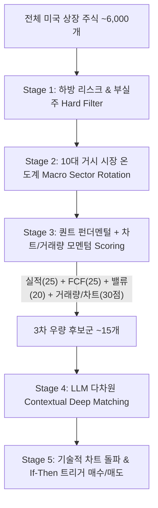

# 📈 [StockLatte] 올인원 거시경제·재무제표·차트/거래량·CapEx·자원수급·정책·환율·비정형 리스크 모니터링 기반 미국 주식 추천 시스템 상세 설계서

> **작성일자:** 2026년 7월 22일 (차트·거래량·이동평균선·OBV·RSI 기술적 분석 파이프라인 최종 완비)  
> **작성자:** 글로벌 미국 주식 수석 트레이더 & AI 시스템 아키텍트  
> **문서 목적:** 거시지표/재무제표뿐만 아니라 **주가 차트(OHLCV), 거래량 폭증(Volume Surge), 이동평균선 정배열/골든크로스, OBV 매집 지수, RSI 과매도/과매수, MACD 변곡점** 등 기술적 분석 지표를 결합하여, **"진짜 세력이 들어온 주가 상방 돌파 타이밍"**을 잡아내는 올인원 미국 주식 매수/매도 추천 자동화 서비스 구축  

---

## 1. 🎯 프로젝트 개요 및 배경

### 1.1 배경 및 문제 정의
* **차트 및 거래량 기술적 분석의 필수성 (Technical & Volume Analysis):** 거시 경제 호재나 재무제표가 아무리 우수하더라도, **주가가 200일 이동평균선 아래 역배열 하락 추세이거나 거래량이 전혀 실리지 않은 가짜 반등(Fakeout)** 상태일 때 매수하면 기회비용 손실이 커집니다.
* **초보 투자자의 한계:** 일반 투자자는 차트 패턴(골든크로스, OBV 세력 매집, 거래량 200% 폭증)을 매일 수천 개 종목에 대해 실시간 계산하고, 펀더멘털 분석과 조합하여 매수 타이밍을 잡기 어렵습니다.
* **해결책:** 100% 무료 주가/거래량 데이터(`yfinance`, `pandas-ta`)를 수집하여 **10대 종합 분석 레이어**로 확충하고, 5단계 추리기 알고리즘에 기술적 차트 및 거래량 타격 시그널을 탑재합니다.

---

## 2. 🧠 전문 트레이더 관점의 10대 종합 분석 레이어 (All-in-One Multi-Layer Approach)

```mermaid
flowchart TD
    A[1. 차트 & 거래량 분석 (yfinance, pandas-ta: OHLCV, 200MA, OBV, RSI, MACD)] --> K[LLM All-in-One Context Matrix]
    B[2. 개별 기업 재무제표 & 펀더멘털 (PER, FCF, 부채비율)] --> K
    C[3. 전방 B2B 수요 & 기업 CapEx (SEC EDGAR, 건설지출, ISM 신규수주)] --> K
    D[4. 자원 수급/생산량/수출입 (EIA, USGS, USDA, LME)] --> K
    E[5. 성장/인플레/정책 (GDP, M2, PCE, 국채발행)] --> K
    F[6. 금융 변동성 & 신용위험 (VIX, MOVE, 하이일드)] --> K
    G[7. 환율 & 무역 제재 (DXY, USD/JPY, BIS 수출통제)] --> K
    H[8. 지정학 & 원자재 (GPR, 유가, 구리, 금)] --> K
    I[9. 비정형 재난 & 기후 (WHO 전염병, NOAA 이상기후)] --> K
    J[10. 기관 수급 & 고용 (CoT, 실업수당, 10Y-2Y 금리차)] --> K
    K --> L[입체적 매수 추천 & 내 포트폴리오 매도 신호 발송]
```

---

## 3. 🌐 올인원 무료 데이터 수집 파이프라인 (All-in-One Data Matrix)

비용은 100% 무료(`yfinance`, `pandas-ta` 파이썬 패키지)로 유지하면서 10대 종합 지표를 정밀하게 수집합니다.

| 분류 | 핵심 지표 / 데이터 | 데이터 출처 (Data Source) | 비용 | 파급 효과 및 트레이더 해석 |
| :--- | :--- | :--- | :--- | :--- |
| **1. 차트 & 거래량 지표** | **거래량 급증 비율 (Volume Surge Ratio)**<br>**이동평균선 (20/50/200 MA 정배열)**<br>**OBV (세력 매집 지표) / RSI / MACD** | **yfinance API** (`OHLCV`)<br>**`pandas-ta` Python** | **100% 무료** | · **거래량 > 200일 평균 200% 폭증:** 기관/세력 수급 유입 시그널<br>· **200MA 상향 돌파/골든크로스:** 기술적 대세 상승 전환<br>· **RSI < 30:** 침체 과매도 구간 (기술적 바닥 매수 타점) |
| **2. 기업 재무제표 & 밸류** | **손익계산서 / 재무상태표 / 현금흐름표**<br>**PER / PBR / FCF / 부채비율** | **yfinance / SEC EDGAR** | **100% 무료** | · **부채비율 > 200%:** 1단계 하드 필터로 자동 제재<br>· **FCF 양수 & 급증:** 퀀트 점수 우대 |
| **3. B2B 수요 & CapEx** | **빅테크 CapEx / 미 건설지출 (`TTLCONS`)**<br>**ISM 신규수주 / 가동률 (`TCU`)** | **SEC EDGAR API** / **FRED API** | **100% 무료** | · **CapEx 증가:** 2단계 수혜 섹터(반도체/인프라) 선정<br>· **수주 잔고(Backlog) 급증:** 퀀트 점수 20점 우대 |
| **4. 자원 생산 & 수출입** | **EIA 원유 재고 / USGS 광물 매장량**<br>**USDA WASDE 곡물 수급 / LME** | **EIA API** / **USGS** / **USDA** | **100% 무료** | · **EIA 원유 재고 감소:** 2단계 에너지 섹터 선정<br>· **중국 희토류 규제:** 4단계 LLM 딥 매칭으로 MP 소재주 선별 |
| **5. 자원 통상 & 제재** | **Global Trade Alert / 무역제재** | **GlobalTradeAlert.org** | **100% 무료** | · **자원 무기화:** 4단계 LLM 분석에서 타격/수혜주 구별 |
| **6. 성장 & 정책 인플레** | **실질 GDP (`GDPC1`) / PCE / M2** | **FRED API** (`fredapi`) | **100% 무료** | · **GDP 2분기 연속 음수:** 1단계 위험 관리 필터 적용 |
| **7. 금융 변동성 & 신용** | **VIX / MOVE / 하이일드 스프레드** | **Yahoo Finance** / **FRED API** | **100% 무료** | · **VIX > 30:** 5단계 매수 트리거 (바닥 매수 신호 연동) |
| **8. 비정형 재난 & 기후** | **WHO 전염병 RSS / NOAA 이상기후** | **WHO RSS** / **NOAA Open Data** | **100% 무료** | · **전염병 경보:** 2단계 바이오 섹터 롤링 적용 |
| **9. 환율 & 무역 제재** | **DXY / USD/JPY / BIS 제재 관보** | **yfinance** / **Federal Register** | **100% 무료** | · **USD/JPY 급락:** 4단계 LLM 딥 분석으로 엔캐리 위험주 제외 |
| **10. 기관 수급 & 고용** | **10Y-2Y 금리차 / 실업수당 (`ICSA`)** | **FRED API** / **CFTC.gov** | **100% 무료** | · **금리차 역전 해제:** 전체 포트폴리오 현금 비중 50% 확대 |

---

## 4. 🎯 5단계 종목 추리기 알고리즘 내 차트/거래량 반영 (Screening Pipeline)



### 4.1 3단계 퀀트 점수표 내 기술적 분석 반영 (Scoring Formula)
$$\text{Total Score (100점)} = \text{실적 모멘텀(25점)} + \text{현금 창출력(25점)} + \text{밸류에이션(20점)} + \mathbf{차트/거래량 모멘텀(30점)}$$

* **차트/거래량 모멘텀 세부 평가 (30점 만점):**
  1. **거래량 폭증 (10점):** 당일 거래량이 20일 평균 거래량 대비 $150\%$ 이상 급증 시 만점.
  2. **이동평균선 정배열 & 200MA 지지 (10점):** 주가가 200일선 위에 위치하고 20일/50일선 정배열 시 만점.
  3. **OBV 세력 매집 & MACD 골든크로스 (10점):** OBV 상승 추세 및 MACD 시그널선 상향 돌파 시 만점.

---

## 5. 🤖 LLM 주입용 올인원 프롬프트 구조 (All-in-One Context Matrix Architecture)

차트 및 거래량 시그널이 포함된 JSON 구조입니다.

```json
{
  "technical_and_volume_analysis": {
    "ticker": "MU",
    "price_action": "$135.00 (200일 이동평균선 상단 위치 - 정배열 상승추세)",
    "volume_surge_ratio": "245% (20일 평균 거래량 대비 폭증 - 세력 유입 시그널 🚀)",
    "obv_indicator": "Bullish Accumulation (OBV 세력 지속 매집 중)",
    "rsi_14d": "62.4 (건전한 상승 구간)",
    "macd_signal": "Golden Cross Confirmed"
  },
  "company_financial_fundamentals": {
    "fcf_status": "+$3.2B",
    "forward_pe": "14.2x"
  },
  "user_portfolio": [
    {"ticker": "MU", "avg_cost": 95.00, "current_price": 135.00, "pnl_pct": "+42.10% (차트 정배열 & 거래량 폭증 - 지속 보유 추천)"}
  ]
}
```

---

## 6. 🖥️ 초보자를 위한 UI/UX 화면 구성 안 (StockLatte Dashboard)

1. **오늘의 글로벌 시장 10대 종합 온도계 (Market Thermometer)**
   * `🟢 차트/거래량: 매우 강함 (추천 종목 거래량 200% 폭증 & 200MA 골든크로스 📈)`
   * `🟢 재무 펀더멘털: 우수 (추천 종목 평균 FCF 흑자 & 부채비율 40% 미만 💎)`
   * `🟢 B2B CapEx/수주: 매우 긍정 (빅테크 AI CapEx +35% 증액 & 건설지출 호조 🚀)`
   * `🔴 자원 수급/무기화: 경계 (중국 희토류 수출 규제 & EIA 원유 재고 급감 ⚠️)`
   * `🔴 지정학 리스크: 높음 (중동 분쟁 변동성 ⚠️)`
   * `🟡 환율/통화 리스크: 주의 (엔화 강세 전환 ⚠️ 엔캐리 청산 경계)`
   * `🔵 무역/통상 규제: 보통 (미 대중 반도체 추가 제재 발표)`
   * `🟢 금리/인플레: 안정 (FOMC 금리 인하 가능성 80%)`
   * `🟢 비정형 보건/기후: 양호 (전염병 경보 없음)`
   * `🟢 신용/변동성: 양호 (VIX 22.5 / 하이일드 스프레드 안정)`

2. **[NEW] 5단계 추리기 알고리즘 결과 리포트 (Top 3 Recommended Stocks)**
   * **최종 엄선 1위:** Micron (MU) - `퀀트 95점 | 차트 200MA 골든크로스 & 거래량 245% 폭증 | Big Tech CapEx 수혜`
   * **최종 엄선 2위:** Intel (INTEL) - `퀀트 88점 | 차트 20일선 바닥 반등 & OBV 매집 | 반도체 보조금 수혜`
   * **최종 엄선 3위:** Caterpillar (CAT) - `퀀트 86점 | 차트 정배열 상승파동 | 미 건설 지출 폭증 수혜`

---

## 7. 🛠️ 단계별 개발 로드맵 (Milestones)

### Phase 1: 10대 데이터 수집 & 차트/거래량 엔진 파이프라인 구축 (1~2주)
* Python 기반 차트/거래량 OHLCV 지표 (`yfinance`, `pandas-ta`), 기업 재무제표, B2B CapEx, 거시지표 파이프라인 구축.
* 사용자 평단가 기반 매도(Sell) 시그널 파이프라인 및 테스트 케이스 구축 (`tests/` 및 `test_results/`).

### Phase 2: AI (Gemini) Stage 4 LLM 딥 매칭 Prompt 연동 (2~3주)
* 퀀트 점수 상위 15개 기업에 대해 뉴스/무역제재 텍스트와 개별 기업 간 인과관계를 딥 분석하는 Prompt Engineering 구현.

### Phase 3: Web Dashboard & 실시간 알림 서비스 구축 (3~4주)
* HTML/Vanilla CSS/JavaScript (또는 Vite React) 기반 5단계 추리기 결과 및 10대 시장 온도계 대시보드 구축.

---

## 8. 📚 참고 문헌 및 데이터 API (References)

1. **Yahoo Finance API (`yfinance`):** https://pypi.org/project/yfinance/ (주가 일봉/주봉 OHLCV, 거래량, 재무제표 100% 무료)
2. **`pandas-ta` Python Library:** https://github.com/twopirllc/pandas-ta (이동평균선, OBV, RSI, MACD 지표 무료 자동 계산)
3. **U.S. SEC EDGAR API:** https://www.sec.gov/edgar/sec-api-documentation (미 상장사 공식 10-Q/K 공시 API)
4. **FRED (Federal Reserve Economic Data):** https://fred.stlouisfed.org/ (건설 지출, 가동률, GDP, M2, PCE 무료 API)
5. **U.S. Energy Information Administration (EIA):** https://www.eia.gov/ (원유/가스 생산 및 재고 API)
6. **WHO Disease Outbreak News:** https://www.who.int/emergencies/disease-outbreak-news (전염병 보건 경보 RSS)
7. **Geopolitical Risk (GPR) Index:** https://www.matteoiacoviello.com/gpr.htm (지정학 리스크 지수)
