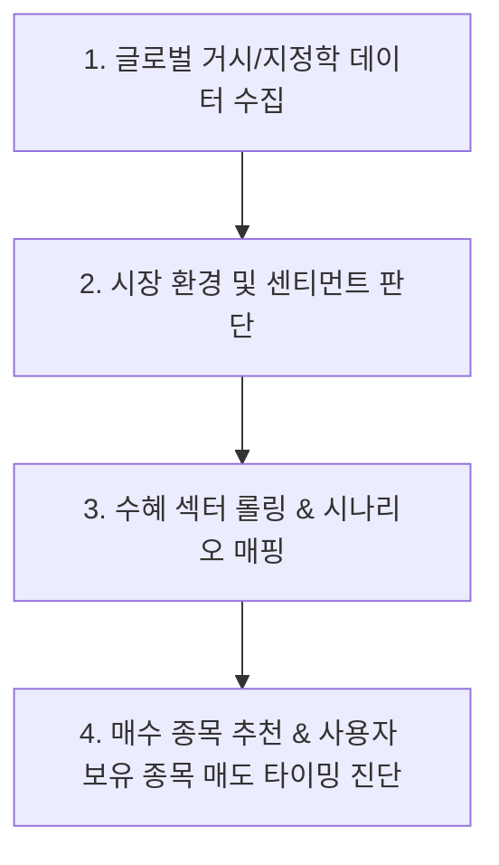
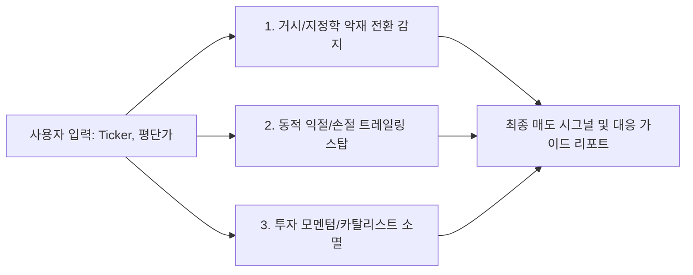

# 📈 [StockLatte] 글로벌 거시경제 및 지정학 리스크 모니터링 기반 미국 주식 추천 시스템 상세 설계서

> **작성일자:** 2026년 7월 22일 (최종 구체화 업데이트)  
> **작성자:** 글로벌 미국 주식 수석 트레이더 & AI 시스템 아키텍트  
> **문서 목적:** 경제 초보자도 매일 세계 경제/전쟁 상황을 한눈에 파악하고, 명확한 트리거 조건에 맞춰 미국 주식 매수/매도(익절·손절) 판단을 내릴 수 있는 가성비 최고(무료 데이터 기반) 자동화 서비스 구축 설계  

---

## 1. 🎯 프로젝트 개요 및 배경

### 1.1 배경 및 문제 정의
* **정보의 과부하 (Information Overload):** 매일 쏟아지는 글로벌 뉴스, FOMC 금리 발표, CPI 인플레이션 지수, 중동/유럽 전쟁 소식, 공급망 이슈 등 수많은 자료를 개인이 매일 분석하는 것은 불가능에 가깝습니다.
* **경제 지식 진입 장벽:** 일반 투자자는 "유가가 오르면 왜 특정 주가가 오르는가?", "금리가 인하되면 어떤 섹터가 수혜를 받는가?"와 같은 **인과관계(Causality)** 및 **매수/매도 적기(Catalyst / Exit Trigger)**를 판단하기 어렵습니다.
* **개인 포트폴리오 관리의 부재:** 매수 추천뿐만 아니라, **"내가 가진 주식을 언제 팔아야 하는가?(매도 타이밍)"**에 대한 리스크 관리 기준이 부족합니다.
* **해결책:** 복잡한 거시경제(Macro) 및 지정학(Geopolitics) 데이터를 **무료/저비용 고품질 API**로 자동 수집·분석하여, 초보 투자자도 10초 만에 이해할 수 있는 **"추천 종목 + 매수/매도 시나리오 + 보유 포트폴리오 진단"** 서비스를 구축합니다.

---

## 2. 🧠 전문 트레이더 관점의 핵심 분석 프레임워크 (Top-Down Approach)

전문 트레이더는 나무(개별 종목)보다 숲(글로벌 거시 경제 및 지정학 판세)을 먼저 봅니다. 본 서비스는 다음 **4단계 Top-Down 분석 체계**를 따릅니다.



### 2.1 주요 데이터 모니터링 지표 매핑

| 카테고리 | 핵심 모니터링 지표 | 트레이더 시각 (의미 분석) | 수혜 섹터/종목 예시 |
| :--- | :--- | :--- | :--- |
| **지정학 (Geopolitics)** | GPR Index (지정학 리스크 지수), 전쟁 뉴스, 호르무즈/대만 해협 긴장도 | 공급망 차단, 원자재 가격 폭등, 국방 예산 증액 | **방산:** LMT, RTX, PLTR<br>**에너지:** XOM, CVX |
| **원자재 (Commodities)** | WTI 원유, 천연가스, 금(Gold), 원자재 지수 | 인플레이션 재발 우려, 안전자산 선호 심리 | **안고자산:** GLD, NEM<br>**에너지:** OXY, VLO |
| **통화/금리 (Macro/Fed)** | 미 연준 기준금리, 점도표(Dot Plot), CPI, DXY (달러 인덱스) | 유동성 환경, 할인율 변화, 성장주 vs 가치주 향방 | **기술/성장주:** NVDA, MSFT, AAPL<br>**금융:** JPM |
| **공급망/반도체** | 대만 긴장 지수, 칩스법(CHIPS Act), 반도체 리드타임 | 글로벌 IT 파운드리 공급 차질 및 대체 생산지 부각 | **미국 내 반도체:** INTEL, AMAT, Micron |

---

## 3. 🌐 최소 비용 고품질 데이터 수집 파이프라인 (Data Source Architecture)

비용을 최소화(무료 플랜 중심)하면서도 전문 금융사 수준의 양질의 데이터를 수집하기 위한 데이터 원천 매핑입니다.

| 분석 데이터 종류 | 데이터 출처 (Data Source) | 제공 방식 / API | 비용 | 데이터 활용 목적 |
| :--- | :--- | :--- | :--- | :--- |
| **거시경제 지표** | **FRED (St. Louis Fed)** | Python `fredapi` | **100% 무료** | 미국 기준금리(FEDFUNDS), 10년물 국채금리(DGS10), CPI, NFP 고용지표 실시간 수집 |
| **주가 / 원자재 / FX** | **Yahoo Finance** | Python `yfinance` | **100% 무료** | 주가 시세, WTI 원유(CL=F), 금(GC=F), DXY 달러인덱스, VIX 지수, PER/PBR 수집 |
| **지정학 리스크 지수** | **GPR Index (Iacoviello)** | Direct CSV / Web Scraping | **100% 무료** | 지정학적 긴장도(Geopolitical Risk Index) 일별/월별 수치 데이터 확보 |
| **글로벌 이벤트/뉴스** | **GDELT Project / Google News RSS** | BigQuery / Python `feedparser` | **100% 무료** | 전쟁, 분쟁, 경제 통상 키워드 텍스트 수집 및 감성 분석 |
| **경제 일정 (Calendar)** | **Investing.com / Yahoo Calendar** | Web Scraping / RSS | **100% 무료** | CPI 발표일, FOMC 회의, 주요 기업 실적 발표일(Earnings Date) 모니터링 |
| **AI 텍스트 분석** | **Google Gemini API** | REST API / Python SDK | **무료 티어 (Free Tier)** | 실시간 뉴스 요약, 지정학 위험도 점수화, 추천/매도 사유 자동 생성 |

---

## 4. ⚙️ 주가 상승(매수) & 포트폴리오 매도(Exit) 시나리오 엔진

본 서비스는 **"언제 사고(Buy Trigger)"** 뿐만 아니라 사용자가 입력한 보유 종목 및 평단가를 바탕으로 **"언제 팔아야 하는지(Sell Signal)"**를 명확하게 제시합니다.

### 4.1 💡 매수(Buy) 시나리오 예시

#### 시나리오 A: 중동 지정학적 긴장 고조 및 유가 상방 돌파
* **상황 조건 (IF):** 중동 지역 분쟁 격화 뉴스 급증 AND WTI 원유 가격 $\$85/bbl$ 돌파.
* **주가 상승 메커니즘 (WHY):** 유가 상승으로 원유 시프링 및 정제 마진 급증, 글로벌 석유 공룡 기업들의 이익 전망치(EPS) 상향 조정.
* **추천 종목:** **Exxon Mobil (XOM)**, **Chevron (CVX)**
* **매수 트리거 (WHEN TO BUY):** WTI 원유 $\$85$ 확정 종가 상회 시 매수 모멘텀 발동.

---

### 4.2 🛑 [NEW] 사용자 포트폴리오 진단 및 매도(Sell / Exit) 추천 알고리즘

사용자가 **[보유 종목 Ticker, 평균 매수가(Cost Basis), 보유 수량]**을 입력하면, 다음 3가지 매도 평가 레이어를 통해 실시간 대응 가이드를 제공합니다.



#### 매도 시그널 3가지 평가 레이어:

1. **거시경제 및 지정학 악재 반전 (Macro Reversal Trigger):**
   * **예시 (에너지/방산 보유 시):** 중동 종전 협상 타결 뉴스 확정 및 유가 $\$70$ 이하 하락세 전환 시 $\rightarrow$ `[익절/비중 축소 권고]`
   * **예시 (기술주 보유 시):** 미 연준 금리 인상 재개 우려 및 10년물 국채 금리 $4.5\%$ 돌파 시 $\rightarrow$ `[위험 관리 매도 권고]`

2. **동적 익절 & 손절 라인 (Dynamic Profit-Taking & Stop-Loss):**
   * **수익 목표 (Take-Profit):** 평단가 대비 $+20\%$ 달성 시 분할 매도(50%) 알림 발송.
   * **리스크 손절 (Stop-Loss):** 평단가 대비 $-7\%$ 내외 하락 시 기술적/기본적 원인 분석과 함께 `[손절 라인 도달 경고]` 발송.
   * **트레일링 스탑 (Trailing Stop):** 고점 대비 $-5\%$ 하락 시 이익 보존 매도 신호 발동.

3. **투자 모멘텀 소멸 (Catalyst Expiration):**
   * 주가 상승의 원인이 되었던 모멘텀(실적 발표 통과, 국방 예산안 통과 등)이 소멸하고 거래량이 감소할 때 `[매도 타점]` 제안.

---

## 5. 📐 시스템 아키텍처 (System Architecture)

```
 [외부 데이터 원천 (100% 무료/저비용)]
 ├── FRED API (금리, CPI, 고용)
 ├── Yahoo Finance (주가, 유가, 금, VIX, FX)
 ├── GPR Index & GDELT / Google News RSS (지정학 뉴스)
 └── Economic Calendar (CPI/FOMC/실적 발표일)
        │
        ▼
 [Data Ingestion & Preprocessing Layer]
        │
        ▼
 [AI Analysis Engine (Gemini Free Tier)]
 ├── 지정학 리스크 점수 산출 (0 ~ 100)
 ├── 센티먼트 분석 (Bullish / Neutral / Bearish)
 └── 핵심 3줄 요약 및 인과 관계 추출
        │
        ▼
 [Rule & Trigger Engine]
 ├── If-Then 매수 시나리오 매칭
 └── [NEW] 사용자 포트폴리오 매도(Sell) 시그널 진단기
        │
        ▼
 [StockLatte UI / Notification System]
 ├── 오늘의 시장 온도계 대시보드
 ├── 종목별 추천 리포트 (매수 타이밍 + 리스크)
 ├── [NEW] 내 포트폴리오 매도 타이밍 진단 탭
 └── 텔레그램 / Discord / 웹 푸시 알림
```

---

## 6. 🖥️ 초보자를 위한 UI/UX 화면 구성 안 (StockLatte Dashboard)

1. **오늘의 글로벌 시장 온도계 (Market Thermometer)**
   * `🔴 지정학 리스크: 높음 (중동 유가 변동성 ⚠️)`
   * `🟢 금리 환경: 중립 (FOMC 대기 중 ⏳)`
   * `오늘의 추천 키워드: #에너지 #방산 #안전자산`

2. **매수 종목 추천 카드 (Buy Recommendation Card)**
   * **종목명:** 엑손모빌 (Exxon Mobil, Ticker: XOM)
   * **추천 등급:** ⭐⭐⭐⭐☆ (매수 모멘텀 임박)
   * **왜 좋은가? (3줄 요약):**
     1. 중동 분쟁 심화로 원유 공급 차질 우려 증가.
     2. 유가 $\$85$ 돌파 시 잉여현금흐름(FCF) 급증으로 자사주 매입 확대 예상.
     3. 배당 수익률 $3.3\%$로 하방 지지력 탄탄.
   * **언제 가격이 오르는가? (상승 카탈리스트):**
     * WTI 원유 주봉 기준 $\$85$ 상방 돌파 시 추가 10~15% 상승 모멘텀 발생.

3. **[NEW] 내 포트폴리오 매도 진단 카드 (Portfolio Sell Assistant)**
   * **입력 예시:** Ticker `NVDA` | 평단가 `$115.00` | 현재가 `$135.00` (수익률 $+17.39\%$)
   * **진단 결과:** `🟡 [익절 분할 매도 고려]`
   * **매도 사유:**
     1. 목표 수익률 $+20\%$ 진입 임박.
     2. 다음 주 FOMC 금리 발표를 앞두고 기술주 차익 실현 물량 출회 가능성 고조.
     3. **추천 대응:** 현재 가격에서 보유 수량의 30% 익절 후, $\$130$ 트레일링 스탑 설정 권장.

---

## 7. 🛠️ 단계별 개발 로드맵 (Milestones)

### Phase 1: 무료 데이터 수집 & 포트폴리오 로직 구축 (1~2주)
* Python 기반 뉴스 및 주요 거시 지표(유가, VIX, 금리) 수집 파이프라인 구축 (`yfinance`, `fredapi`, `feedparser`).
* 사용자 평단가 기반 매도(Sell) 시그널 파이프라인 및 테스트 케이스 구축 (`tests/` 및 `test_results/`).

### Phase 2: AI (LLM) 기반 분석 Engine & 매도 진단기 연동 (2~3주)
* Gemini Free Tier API 연동으로 뉴스 감성 분석 및 지정학 리스크 점수 자동 산출.
* 매수 이유 및 보유 종목 매도 진단 리포트 문장 자동 생성 Prompt Engineering 적용.

### Phase 3: Web Dashboard & 실시간 알림 서비스 구축 (3~4주)
* HTML/Vanilla CSS/JavaScript (또는 Vite React) 기반의 직관적이고 현대적인 UI 개발.
* 매일 아침 시장 브리핑 및 포트폴리오 매도 타점 푸시 알림 연동.

---

## 8. 📚 참고 문헌 및 데이터 API (References)

1. **FRED (Federal Reserve Economic Data):** https://fred.stlouisfed.org/ (미국 금리, 인플레이션 무료 API)
2. **Yahoo Finance API (yfinance):** https://pypi.org/project/yfinance/ (미국 주식 및 원자재 시세 무료 API)
3. **Geopolitical Risk (GPR) Index:** https://www.matteoiacoviello.com/gpr.htm (지정학 리스크 지수 데이터)
4. **GDELT Project:** https://www.gdeltproject.org/ (글로벌 이벤트 및 지정학 텍스트 데이터)
5. **U.S. Energy Information Administration (EIA):** https://www.eia.gov/ (원유 공급 및 유가 통계)
