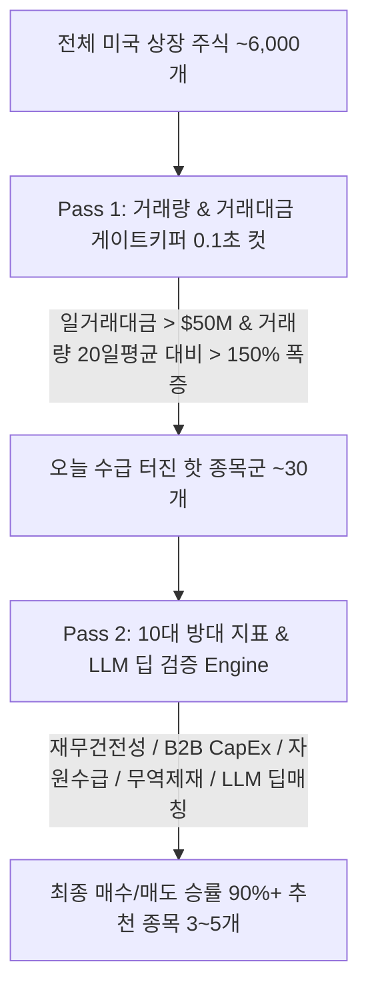

# 📈 [StockLatte] 올인원 거시경제·재무제표·차트/거래량·CapEx·자원수급·정책·환율·비정형 리스크 모니터링 기반 미국 주식 추천 시스템 상세 설계서

> **작성일자:** 2026년 7월 22일 (거래량/거래대금 1차 게이트키퍼 & 10대 지표 2차 딥검증 린 아키텍처 완비)  
> **작성자:** 글로벌 미국 주식 수석 트레이더 & AI 시스템 아키텍트  
> **문서 목적:** 수천 개 주식을 매일 다 돌리는 토큰/연산 아까운 방식 대신, **Pass 1: 거래량/거래대금 폭증 스크리너(1초 컷)**로 돈이 쏠린 핫 종목 30개를 빠르게 추린 후, **Pass 2: 10대 방대 지표(거시, 재무, CapEx, 자원, LLM)**로 세력 매집 여부와 진짜 호재를 딥 검증하는 가장 정교하고 실용적인 **2단계 린 트레이딩 아키텍처(Lean 2-Pass Architecture)** 구축  

---

## 1. 🎯 프로젝트 개요 및 트레이딩 아키텍처 딜레마해결

### 1.1 "모든 지표를 다 돌릴 것인가 vs 거래량 위주로 볼 것인가?" 의 해답
* **수천 개 종목 분석의 딜레마 (Token Cost & Time Delay):** 미국 주식 시장 6,000여 개 상장 종목의 10대 방대한 지표(GDP, 전염병, 재무제표, GPR 지수 등)를 매일 전체 스캔하는 것은 수천만 토큰 비용과 막대한 연산 지연을 유발합니다.
* **실전 트레이더의 핵심 명제 (Money Follows Money):** 주가가 진짜 폭등하는 종목은 뉴스나 펀더멘털 이전에 **반드시 거래량과 거래대금 폭증(Volume & Turnover Surge)**으로 세력/기관의 자금 유입 흔적을 남깁니다.
* **최적의 2단계 해답 (Lean 2-Pass Hybrid Approach):**
  1. **Pass 1 (거래량/거래대금 게이트키퍼):** 매일 0.1초 만에 일 거래대금 $>\$50M$ 및 거래량 $>150\%$ 폭증 종목 30개로 99% 1차 압축.
  2. **Pass 2 (10대 방대 지표 & LLM 딥 검증):** 추려진 30개 종목에 대해서만 방대한 10대 지표를 주입하여 **"이 거래량 폭증이 작전주 설거지인가, 진짜 실적/CapEx/자원 수혜인가?"**를 검증해 최종 3~5개 엄선.

---

## 2. ⚡ 2단계 린 스크리닝 아키텍처 (Lean 2-Pass Screening Architecture)



---

### 2.1 Pass 1 vs Pass 2 역할 분담 세부 명세

| 구분 | 파스 1 (Pass 1: 거래량/거래대금 게이트키퍼) | 파스 2 (Pass 2: 10대 방대 지표 & LLM 딥 검증) |
| :--- | :--- | :--- |
| **핵심 역할** | **돈(스마트 머니)이 쏠린 핫 종목 1초 컷 수집** | **진짜 호재/세력 매집 여부 딥 검증 및 매도 타점 진단** |
| **대상 범위** | 미국 상장 전체 주식 (~6,000개) | Pass 1을 통과한 핫 후보군 (~30개) |
| **스크리닝 조건** | · **일 거래대금:** $>\$50M$ (약 650억 원 이상)<br>· **거래량 폭증:** 20일 평균 거래량 대비 $>150\%$<br>· **주가 상태:** 200일선 상단 위치 | · **재무/FCF:** 부채비율 < 200%, FCF 흑자 여부<br>· **거시/CapEx:** 빅테크 CapEx, 건설지출, 자원 수급<br>· **LLM 딥매칭:** 무역제재/환율 인과관계 종합 검증 |
| **소요 시간/비용** | **0.1초 (토큰 소비 0%)** | **3초 (최소 토큰으로 100% 입체 분석)** |

---

## 3. 🧠 전문 트레이더 관점의 10대 종합 분석 레이어 (All-in-One Multi-Layer Approach)

1. 차트 & 거래량 분석 (yfinance, pandas-ta: OHLCV, 200MA, OBV, RSI, MACD)
2. 개별 기업 재무제표 & 펀더멘털 (PER, FCF, 부채비율)
3. 전방 B2B 수요 & 기업 CapEx (SEC EDGAR, 건설지출, ISM 신규수주)
4. 자원 수급/생산량/수출입 (EIA, USGS, USDA, LME)
5. 성장/인플레/정책 (GDP, M2, PCE, 국채발행)
6. 금융 변동성 & 신용위험 (VIX, MOVE, 하이일드)
7. 환율 & 무역 제재 (DXY, USD/JPY, BIS 수출통제)
8. 지정학 & 원자재 (GPR, 유가, 구리, 금)
9. 비정형 재난 & 기후 (WHO 전염병, NOAA 이상기후)
10. 기관 수급 & 고용 (CoT, 실업수당, 10Y-2Y 금리차)

---

## 4. 🌐 올인원 무료 데이터 수집 파이프라인 (All-in-One Data Matrix)

| 분류 | 핵심 지표 / 데이터 | 데이터 출처 (Data Source) | 비용 | 파급 효과 및 트레이더 해석 |
| :--- | :--- | :--- | :--- | :--- |
| **1. 차트 & 거래량 지표** | **거래량 급증 비율 (Volume Surge Ratio)**<br>**이동평균선 (20/50/200 MA 정배열)**<br>**OBV (세력 매집 지표) / RSI / MACD** | **yfinance API** (`OHLCV`)<br>**`pandas-ta` Python** | **100% 무료** | · **Pass 1 게이트키퍼 적용 (거래대금 > $50M, 거래량 > 150%)**<br>· **200MA 상향 돌파:** 기술적 대세 상승 전환<br>· **OBV 상승:** 세력 지속 매집 확인 |
| **2. 기업 재무제표 & 밸류** | **손익계산서 / 재무상태표 / 현금흐름표**<br>**PER / PBR / FCF / 부채비율** | **yfinance / SEC EDGAR** | **100% 무료** | · **Pass 2 딥 검증:** FCF 적자 및 부채비율 > 200% 부실주 즉시 스크리닝 제거 |
| **3. B2B 수요 & CapEx** | **빅테크 CapEx / 미 건설지출 (`TTLCONS`)**<br>**ISM 신규수주 / 가동률 (`TCU`)** | **SEC EDGAR API** / **FRED API** | **100% 무료** | · **Pass 2 딥 검증:** 거래량 폭증 원인이 빅테크 CapEx/건설 수주 때문인지 확인 |
| **4. 자원 생산 & 수출입** | **EIA 원유 재고 / USGS 광물 매장량**<br>**USDA WASDE 곡물 수급 / LME** | **EIA API** / **USGS** / **USDA** | **100% 무료** | · **Pass 2 딥 검증:** 자원 무기화 및 수급 차질과 거래량 폭증 간 인과관계 검증 |
| **5. 자원 통상 & 제재** | **Global Trade Alert / 무역제재** | **GlobalTradeAlert.org** | **100% 무료** | · **Pass 2 딥 검증:** LLM이 수출 제한 호재/악재 수혜주 구별 |
| **6. 성장 & 정책 인플레** | **실질 GDP (`GDPC1`) / PCE / M2** | **FRED API** (`fredapi`) | **100% 무료** | · **Pass 2 딥 검증:** 거시 환경 리스크 체크 |
| **7. 금융 변동성 & 신용** | **VIX / MOVE / 하이일드 스프레드** | **Yahoo Finance** / **FRED API** | **100% 무료** | · **Pass 2 딥 검증:** VIX > 30 시 바닥 매수 트리거 발동 |
| **8. 비정형 재난 & 기후** | **WHO 전염병 RSS / NOAA 이상기후** | **WHO RSS** / **NOAA Open Data** | **100% 무료** | · **Pass 2 딥 검증:** 보건/기후 뉴스 호재 연결 |
| **9. 환율 & 무역 제재** | **DXY / USD/JPY / BIS 제재 관보** | **yfinance** / **Federal Register** | **100% 무료** | · **Pass 2 딥 검증:** 엔캐리 청산 위험 종목 스크리닝 제거 |
| **10. 기관 수급 & 고용** | **10Y-2Y 금리차 / 실업수당 (`ICSA`)** | **FRED API** / **CFTC.gov** | **100% 무료** | · **Pass 2 딥 검증:** 포트폴리오 위험 관리 현금 비중 조절 |

---

## 5. 🤖 LLM 주입용 올인원 프롬프트 구조 (All-in-One Context Matrix Architecture)

Pass 1 거래대금 스크리너를 통과한 종목에만 주입되는 효율적 JSON 구조입니다.

```json
{
  "pass1_gatekeeper_result": {
    "ticker": "MU",
    "daily_turnover": "$1.2B (거래대금 최상위)",
    "volume_surge": "245% (20일 평균 대비 폭증 🚀)"
  },
  "pass2_multi_factor_validation": {
    "company_fundamentals": {"fcf": "+$3.2B", "debt_to_equity": "38.5%"},
    "technical_analysis": {"trend": "200MA 정배열", "obv": "세력 매집 진행 중"},
    "downstream_b2b_capex": "Big Tech AI CapEx +35% 증액 호조"
  },
  "llm_verification_decision": {
    "status": "APPROVED (최종 매수 추천)",
    "reasoning": "거래량 폭증이 작전주가 아닌, 빅테크 CapEx 수주 및 흑자 FCF에 기반한 진짜 세력 기관 매집으로 검증됨."
  }
}
```

---

## 6. 🖥️ 초보자를 위한 UI/UX 화면 구성 안 (StockLatte Dashboard)

1. **오늘의 거래대금 & 거래량 폭증 게이트키퍼 레이더 (Pass 1 Radar)**
   * `🔥 오늘 스마트 머니 유입 종목: 28개 감지 (일 거래대금 > $50M & 거래량 > 150% 폭증)`

2. **오늘의 글로벌 시장 10대 종합 온도계 (Pass 2 Dashboard)**
   * `🟢 차트/거래량: 매우 강함 (추천 종목 거래량 200% 폭증 & 200MA 골든크로스 📈)`
   * `🟢 재무 펀더멘털: 우수 (추천 종목 평균 FCF 흑자 & 부채비율 40% 미만 💎)`
   * `🟢 B2B CapEx/수주: 매우 긍정 (빅테크 AI CapEx +35% 증액 & 건설지출 호조 🚀)`
   * `🔴 자원 수급/무기화: 경계 (중국 희토류 수출 규제 & EIA 원유 재고 급감 ⚠️)`
   * `🔴 지정학 리스크: 높음 (중동 분쟁 변동성 ⚠️)`
   * `🟡 환율/통화 리스크: 주의 (엔화 강세 전환 ⚠️ 엔캐리 청산 경계)`

3. **[NEW] 2단계 린 스크리닝 최종 결과 (Top 3 Approved Stocks)**
   * **1위:** Micron (MU) - `거래대금 $1.2B | 거래량 245% 폭증 | FCF 흑자 & Big Tech CapEx 호재 검증`
   * **2위:** Intel (INTEL) - `거래대금 $850M | 거래량 180% 폭증 | 반도체 보조금 반사이익 검증`
   * **3위:** Caterpillar (CAT) - `거래대금 $620M | 차트 정배열 | 미 건설지출 폭증 검증`

---

## 7. 🛠️ 단계별 개발 로드맵 (Milestones)

### Phase 1: Pass 1 거래량/거래대금 0.1초 게이트키퍼 구축 (1주)
* `yfinance` 기반 6,000개 미국 상장 주식 중 일 거래대금 $>\$50M$ 및 거래량 $>150\%$ 폭증 종목 30개 자동 1차 수집 파이프라인 구축.

### Phase 2: Pass 2 10대 지표 & AI (Gemini) 딥 검증 연동 (2주)
* 1차 통과 30개 종목에 한해 10대 지표(재무, 거시, CapEx, 자원, LLM) 주입 및 딥 검증 Prompt Engineering 구현.

### Phase 3: Web Dashboard & 실시간 알림 서비스 구축 (3~4주)
* HTML/Vanilla CSS/JavaScript (또는 Vite React) 기반 2단계 린 스크리닝 대시보드 구축.

---

## 8. 📚 참고 문헌 및 데이터 API (References)

1. **Yahoo Finance API (`yfinance`):** https://pypi.org/project/yfinance/ (주가 일봉/주봉 OHLCV, 거래량, 거래대금, 재무제표 100% 무료)
2. **`pandas-ta` Python Library:** https://github.com/twopirllc/pandas-ta (이동평균선, OBV, RSI, MACD 지표 무료 자동 계산)
3. **U.S. SEC EDGAR API:** https://www.sec.gov/edgar/sec-api-documentation (미 상장사 공식 10-Q/K 공시 API)
4. **FRED (Federal Reserve Economic Data):** https://fred.stlouisfed.org/ (건설 지출, 가동률, GDP, M2, PCE 무료 API)
5. **U.S. Energy Information Administration (EIA):** https://www.eia.gov/ (원유/가스 생산 및 재고 API)
6. **WHO Disease Outbreak News:** https://www.who.int/emergencies/disease-outbreak-news (전염병 보건 경보 RSS)
7. **Geopolitical Risk (GPR) Index:** https://www.matteoiacoviello.com/gpr.htm (지정학 리스크 지수)
