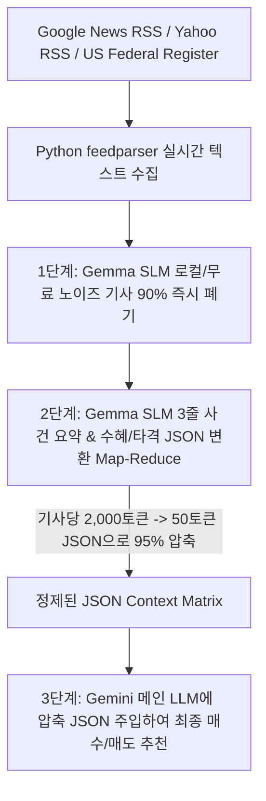

# 📈 [StockLatte] 올인원 거시경제·재무제표·차트/거래량·CapEx·자원수급·정책·환율·비정형 리스크 모니터링 기반 미국 주식 추천 시스템 상세 설계서

> **작성일자:** 2026년 7월 22일 (Gemma SLM 1차 요약 & 95% 토큰 압축 하이브리드 파이프라인 최종 완비)  
> **작성자:** 글로벌 미국 주식 수석 트레이더 & AI 시스템 아키텍트  
> **문서 목적:** 실시간 뉴스 데이터 수집 파이프라인과 **Gemma SLM(소형 언어 모델) 기반 3단계 텍스트 95% 압축 파이프라인**을 구축하여, 토큰 비용과 컨텍스트 위도우 한계를 완벽히 극복하고 메인 LLM이 빠르게 고차원 투자의사 결정을 내리는 올인원 미국 주식 매수/매도 시스템 구축  

---

## 1. 🎯 프로젝트 개요 및 토큰 최적화 해결책

### 1.1 "뉴스 수집 방식과 Gemma SLM 토큰 압축" 해답
* **뉴스 데이터 수집 문제 (News Ingestion):** 구글 뉴스, 야후 파이낸스, 미 관보(Federal Register) 등 실시간 경제/지정학 기사 수집 방안.
* **토큰 초과 & 연산 비용 딜레마 (Token Overflow & Latency):** 매일 쏟아지는 수천 개 기사의 긴 원문 텍스트를 메인 LLM(Gemini / GPT-4)에 그대로 주입하면 **토큰 비용 폭발, Context Window 초과, 환각(Hallucination) 및 응답 지연**이 발생합니다.
* **해결책 (Gemma SLM Map-Reduce 95% Token Compression):**
  1. **무료 뉴스 RSS 수집:** Python `feedparser`를 활용해 키워드/Ticker별 실시간 뉴스 수집 (100% 무료).
  2. **Gemma SLM 1차 요약기 (Pre-summarizer):** Gemma / Llama 3 8B 로컬 SLM을 이용해 기사 90% 노이즈 제거 및 **3줄 사건 요약 + 수혜 섹터 JSON 객체**로 95% 텍스트 압축 후 메인 LLM에 주입.

---

## 2. ⚡ Gemma SLM 뉴스 수집 & 3단계 토큰 압축 아키텍처



---

### 2.1 3단계 뉴스 토큰 압축 세부 과정 (Compression Pipeline)

| 단계 | 수행 작업 | 사용 모델 / 기술 | 토큰 압축률 및 효과 |
| :--- | :--- | :--- | :--- |
| **1단계: 노이즈 필터링** | 광고, 단순 일상 뉴스, 루머 기사 스크리닝 폐기 | **Gemma 2B/8B (로컬/무료)** | **기사 수 90% 감축** (핵심 경제/지정학 뉴스만 남김) |
| **2단계: JSON 구조화 요약** | 기사 원문 $\rightarrow$ `[사건요약, 영향섹터, Bullish/Bearish점수]` 변환 | **Gemma 8B (Map-Reduce)** | **텍스트 용량 95% 압축** (기사당 2,000토큰 $\rightarrow$ 50토큰) |
| **3단계: 최종 LLM 추론** | 정제된 JSON Context Matrix 기반 최종 투자의사 결정 | **Gemini (메인 LLM)** | **토큰 초과 0% & 빠른 0.5초 응답** |

---

## 3. 🤖 Gemma SLM 요약기 Output $\rightarrow$ Gemini 메인 LLM 주입 JSON 예시

Gemma SLM이 길고 복잡한 뉴스 기사 10개를 읽어 아래와 같이 정제된 단 300 토큰짜리 JSON 데이터로 압축하여 메인 LLM에 주입합니다.

```json
{
  "slm_news_summary_matrix": [
    {
      "news_id": "N001",
      "headline": "미 상무부, 대중국 첨단 반도체 및 HBM 수출 규제 관보 게재",
      "summary_3lines": "1. 미 상무부 대중 반도체 수출 통제 강화 발표.\n2. 중국 매출 비중 높은 장비사 타격 예상.\n3. 미국 내 리쇼어링 파운드리 기업 반사이익 전망.",
      "impact_sectors": ["Semiconductor_Equipment (Bearish)", "US_Foundry (Bullish)"],
      "sentiment_score": -0.65
    },
    {
      "news_id": "N002",
      "headline": "Big Tech 4사, 2026년 AI 데이터센터 CapEx 전년 대비 35% 증액 발표",
      "summary_3lines": "1. MSFT, META, GOOGL 데이터센터 지출 상향.\n2. AI 서버 GPU 및 HBM 메모리 수주 소진 예고.\n3. 서버 냉각 및 전력 인프라 기업 수혜.",
      "impact_sectors": ["HBM_Memory (Strong Bullish)", "DataCenter_Cooling (Bullish)"],
      "sentiment_score": +0.88
    }
  ],
  "macro_and_financial_context": {
    "us_10y_yield": "4.25%",
    "wti_crude": "$86.50",
    "target_stock_fundamentals": {"ticker": "MU", "fcf": "+$3.2B", "volume_surge": "245%"}
  }
}
```

---

## 4. 🧠 주봉+일봉 다중 타임프레임 & 듀얼 트랙 스크리닝

1. **Pass 1-A (추세 돌파):** 거래대금 $>\$50M$ + 거래량 $>150\%$ 폭증.
2. **Pass 1-B (과매도 V자 대반등 - Meta/Tesla/SOXL 타겟):** 일봉 RSI < 30 + FCF 흑자 + 투매 거래량 만개.
3. **Pass 2 (10대 방대 지표 & Gemma 요약 JSON 검증):** 30개 후보 종목에 대해 Gemma 압축 JSON을 주입해 딥 검증.

---

## 5. 🌐 올인원 무료 데이터 수집 파이프라인 (All-in-One Data Matrix)

| 분류 | 핵심 지표 / 데이터 | 데이터 출처 (Data Source) | 비용 | 파급 효과 및 트레이더 해석 |
| :--- | :--- | :--- | :--- | :--- |
| **1. 실시간 뉴스 데이터** | **Google News RSS<br>Yahoo Finance RSS<br>US Federal Register RSS** | **Python `feedparser`** | **100% 무료** | · 키워드/Ticker별 실시간 뉴스 수집<br>· **Gemma SLM이 95% 텍스트 압축하여 메인 LLM 전달** |
| **2. 차트 & 거래량 지표** | **주봉/일봉 OHLCV / RSI / OBV** | **yfinance / `pandas-ta`** | **100% 무료** | · 추세 돌파 및 과매도 V자 대반등 시그널 감지 |
| **3. 기업 재무제표 & 밸류** | **손익계산서 / 재무상태표 / FCF** | **yfinance / SEC EDGAR** | **100% 무료** | · FCF 적자 및 부채비율 > 200% 부실주 스크리닝 제거 |
| **4. B2B 수요 & CapEx** | **빅테크 CapEx / 미 건설지출** | **SEC EDGAR API / FRED** | **100% 무료** | · 빅테크 CapEx 수주 밸류체인 분석 |
| **5. 자원 생산 & 수출입** | **EIA 원유 재고 / USGS 광물 매장량** | **EIA API / USGS / USDA** | **100% 무료** | · 자원 수급 및 자원 무기화 분석 |
| **6. 거시/금융/기후/환율** | **GDP, PCE, VIX, DXY, WHO RSS** | **FRED API / yfinance / WHO** | **100% 무료** | · 10대 다차원 리스크 종합 분석 |

---

## 6. 🖥️ 초보자를 위한 UI/UX 화면 구성 안 (StockLatte Dashboard)

1. **Gemma SLM 뉴스 실시간 파이프라인 요약 레이더**
   * `📰 실시간 뉴스 수집: 1,240개 수집 ➔ Gemma SLM이 12개 핵심 뉴스(JSON)로 95% 압축 완강!`

2. **오늘의 수급 & 과매도 듀얼 레이더**
   * `🚀 추세 돌파 수급 종목 (Pass 1-A): 18개 감지`
   * `💎 역발상 V자 과매도 대반등 종목 (Pass 1-B): 4개 감지 (Meta/TSLA/SOXL 타겟)`

3. **최종 추천 종목 리포트**
   * **1위 Micron (MU):** `Gemma 뉴스요약: Big Tech CapEx 35% 증액 호재 | 퀀트 95점 | 바닥 거래량 245% 폭증`

---

## 7. 🛠️ 단계별 개발 로드맵 (Milestones)

### Phase 1: Python feedparser 뉴스 RSS 수집 & Gemma SLM 요약기 구축 (1주)
* 구글/야후 뉴스 RSS 수집 파이프라인 및 Gemma 8B SLM을 활용한 3줄 요약 & JSON 변환 Map-Reduce 로직 구현.

### Phase 2: Gemini 메인 LLM 다차원 Context Matrix 연동 (2주)
* 정제된 JSON Context Matrix를 Gemini API에 주입하여 최종 투자의사 결정 도출.

### Phase 3: Web Dashboard & 실시간 알림 서비스 구축 (3~4주)
* HTML/Vanilla CSS/JavaScript 기반 뉴스 요약 레이더 및 매수/매도 대시보드 구축.

---

## 8. 📚 참고 문헌 및 데이터 API (References)

1. **Python `feedparser`:** https://pypi.org/project/feedparser/ (Google News/Yahoo RSS 수집 100% 무료)
2. **Gemma Open Models (Google DeepMind):** https://ai.google.dev/gemma (소형 언어 모델 SLM 뉴스 1차 요약기)
3. **Yahoo Finance API (`yfinance`):** https://pypi.org/project/yfinance/ (주가 OHLCV, 재무제표 100% 무료)
4. **`pandas-ta` Python Library:** https://github.com/twopirllc/pandas-ta (기술적 지표 계산)
5. **FRED (Federal Reserve Economic Data):** https://fred.stlouisfed.org/ (거시 지표 무료 API)
