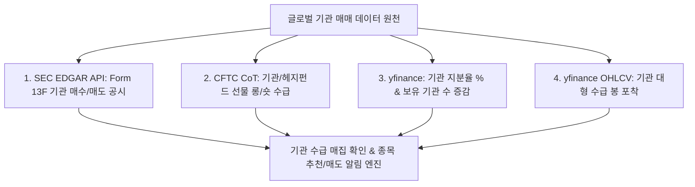

# 📈 [StockLatte] 올인원 거시경제·재무제표·차트/거래량·기관수급(13F)·CapEx·자원수급·정책·환율·비정형 리스크 모니터링 기반 미국 주식 추천 시스템 상세 설계서

> **작성일자:** 2026년 7월 22일 (SEC 13F & CFTC CoT 기관 매매 추적 파이프라인 최종 완비)  
> **작성자:** 글로벌 미국 주식 수석 트레이더 & AI 시스템 아키텍트  
> **문서 목적:** 월가 거물 기관(블랙록, 버크셔 해서웨이 등)의 매매를 추적하는 **SEC Form 13F 기관 분기 매수/매도 공시**, **CFTC CoT 기관 선물 롱/숏 수급 리포트**, **yfinance 기관 지분율(Institutional Ownership %)** 지표를 수집하여, 기관 세력의 매집 종목을 포착하고 매수/매도 타이밍을 제공하는 자동화 서비스 구축  

---

## 1. 🎯 프로젝트 개요 및 기관 매매 추적 설계

### 1.1 "기관 매매 추적 지표(SEC 13F & CFTC CoT)" 해답
* **기관 매매 추적의 필수성 (Institutional Money Flow):** 미국 주식 시장 거래량의 80% 이상은 기관 투자자(블랙록, 뱅가드, 버크셔 해서웨이, 헤지펀드 등)가 차지합니다. 기관의 수급 방향을 추적하지 않고 개미 투자자 단독으로 대응하는 것은 한계가 있습니다.
* **4대 기관 매매 추적 공식 지표 (100% 무료):**
  1. **SEC Form 13F (기관 보유 지분 공시):** $\$100M$ 이상 운용 기관이 매 분기 어떤 종목을 사들였고 전량 매도했는지 의무 제출하는 공식 보고서 파싱.
  2. **CFTC CoT Report (상품선물거래위원회 기관 수급):** 기관/헤지펀드의 S&P500, 나스닥, 원유 선물 롱/숏 포지션 매주 확인.
  3. **기관 지분율 & 보유 기관 수 (`yfinance`):** 개별 종목의 기관 지분율(%) 및 보유 기관 수 증감 추이.
  4. **기관 블록딜 & 거래량 폭증 봉:** 장중 기관 자금 유입 수급 봉 포착.

---

## 2. 🏛️ 기관 매매 추적 4대 데이터 파이프라인 (Institutional Data Pipeline)



---

### 2.1 기관 매매 추적 지표 세부 명세

| 지표명 | 수집 원천 (Data Source) | 비용 | 트레이더 해석 및 시스템 활용 |
| :--- | :--- | :--- | :--- |
| **SEC Form 13F** | **SEC EDGAR API** (공식 13F-HR) | **100% 무료** | · 워런 버핏, 블랙록 등 거물 기관이 **신규 매수한 종목** 포착<br>· 기관 전량 매도(Exit) 종목 매도 경고 |
| **CFTC CoT Report** | **CFTC.gov / FRED API** | **100% 무료** | · 매주 금요일 기관/헤지펀드의 나스닥/S&P500 선물 **롱(Long) 베팅 우세 시 Risk-On 시그널** |
| **기관 지분율 (%)** | **yfinance API** (`institutional_holders`) | **100% 무료** | · 기관 지분율 $> 70\%$ 이상 종목은 강력한 하방 지지선 구축 |
| **보유 기관 수 증감** | **yfinance API** (`major_holders`) | **100% 무료** | · 보유 기관 수가 2분기 연속 증가하는 종목 퀀트 우대 |

---

## 3. 🤖 LLM 주입용 기관 수급(13F) 분석 프롬프트

기관의 13F 공시 및 수급 데이터를 LLM이 종합 평가하는 JSON 구조입니다.

```json
{
  "institutional_money_flow": {
    "ticker": "MU",
    "sec_13f_filings": {
      "quarter": "Q2 2026",
      "major_institutional_buyers": ["Berkshire Hathaway (신규 매수)", "BlackRock (+12% 비중 확대)"],
      "institutional_sellers": "None (전량 매도 기관 없음)"
    },
    "institutional_ownership_pct": "78.4% (전분기 대비 +3.2%p 증가)",
    "institutional_holder_count": "3,450개 기관 (2분기 연속 증가 🚀)",
    "cftc_futures_sentiment": "Net Long Position (기관 선물 롱 포지션 확대)"
  },
  "llm_action_decision": {
    "signal": "INSTITUTIONAL_ACCUMULATION_CONFIRMED (기관 세력 매집 확인)",
    "reasoning": "SEC 13F 공시 결과 워런 버핏 및 블랙록이 동시 비중을 확대하였으며, 기관 지분율이 78%에 달해 강력한 주가 상승 안전판이 구축됨."
  }
}
```

---

## 4. 🌐 올인원 무료 데이터 수집 파이프라인 (All-in-One Data Matrix)

| 분류 | 핵심 지표 / 데이터 | 데이터 출처 (Data Source) | 비용 | 파급 효과 및 트레이더 해석 |
| :--- | :--- | :--- | :--- | :--- |
| **1. 기관 매매 지표** | **SEC Form 13F 공시<br>CFTC CoT 선물 수급<br>기관 지분율 / 보유 기관 수** | **SEC EDGAR API**<br>**CFTC.gov / FRED API**<br>**yfinance API** | **100% 무료** | · **SEC 13F:** 거물 기관 신규 매수 종목 포착<br>· **기관 지분율 > 70%:** 주가 안성정 우대<br>· **CFTC CoT:** 기관 선물 롱/숏 수급 확인 |
| **2. 차트 & 거래량** | **50/200일 MA / RSI / OBV** | **yfinance / `pandas-ta`** | **100% 무료** | · 기관 수급 봉 및 조정 바닥 재매수 타점 감지 |
| **3. 뉴스 & Gemma 요약** | **Google/Yahoo RSS** | **Python `feedparser` / Gemma** | **100% 무료** | · Gemma SLM이 기사 95% 압축 후 전달 |
| **4. 기업 재무제표** | **손익계산서 / FCF / 부채비율** | **yfinance / SEC EDGAR** | **100% 무료** | · FCF 흑자 1등 우량주만 조정 바닥 재매수 허용 |
| **5. B2B CapEx & 자원** | **빅테크 CapEx / EIA / USGS** | **SEC EDGAR / EIA / USGS** | **100% 무료** | · 우량주 전방 산업 펀더멘털 건재 검증 |
| **6. 거시/금융/기후/환율** | **GDP, PCE, VIX, DXY** | **FRED API / yfinance** | **100% 무료** | · VIX 지수 피크아웃 시 바닥 재매수 연동 |

---

## 5. 🖥️ 초보자를 위한 UI/UX 화면 구성 안 (StockLatte Dashboard)

1. **오늘의 기관 수급 & 13F 포착 레이더 (Institutional Radar)**
   * `🏛️ SEC 13F 기관 신규 매수 포착: 버크셔 해서웨이 & 블랙록 동시 매수 감지 (Micron Technology)`
   * `📊 기관 지분율 우수 종목: 기관 지분율 78% (안전판 구축)`

2. **[NEW] 기관 매매 분석 리포트 (Institutional Flow Report)**
   * **Micron (MU):** `SEC 13F 버크셔 해서웨이 신규 매수 확인 | 기관 지분율 78.4% | CFTC 선물 롱 베팅 ➔ 기관 세력 매집 주도주 승인`
   * **Tesla (TSLA):** `조정 완료 | 기관 지지선 50일선 터치 | 13F 기관 보유 수 +4.5% 증가 ➔ 기관 수급 유입 바닥 재매수`

---

## 6. 🛠️ 단계별 개발 로드맵 (Milestones)

### Phase 1: SEC 13F & CFTC CoT 수급 파이프라인 구축 (1주)
* SEC EDGAR API 기반 13F 공시 파싱 파이프라인 및 CFTC CoT 선물 롱/숏 지표 수집 로직 구현.

### Phase 2: AI (Gemini) 기관 수급 분석 Prompt 연동 (2주)
* 13F 기관 신규 매수 데이터와 펀더멘털을 대입하여 기관 수급 주도주 진단 리포트를 생성하는 Prompt 연동.

### Phase 3: Web Dashboard & 실시간 알림 서비스 구축 (3~4주)
* HTML/Vanilla CSS/JavaScript 기반 기관 수급 13F 레이더 대시보드 구축.

---

## 7. 📚 참고 문헌 및 데이터 API (References)

1. **U.S. SEC EDGAR 13F API:** https://www.sec.gov/edgar/sec-api-documentation (13F 기관 지분 공시 100% 무료 API)
2. **CFTC Commitment of Traders (CoT):** https://www.cftc.gov/MarketReports/CommitmentsofTraders/index.htm (기관 선물 수급)
3. **Yahoo Finance API (`yfinance`):** https://pypi.org/project/yfinance/ (`institutional_holders` 기관 지분율 무료)
4. **FRED (Federal Reserve Economic Data):** https://fred.stlouisfed.org/ (거시 지표 무료 API)
