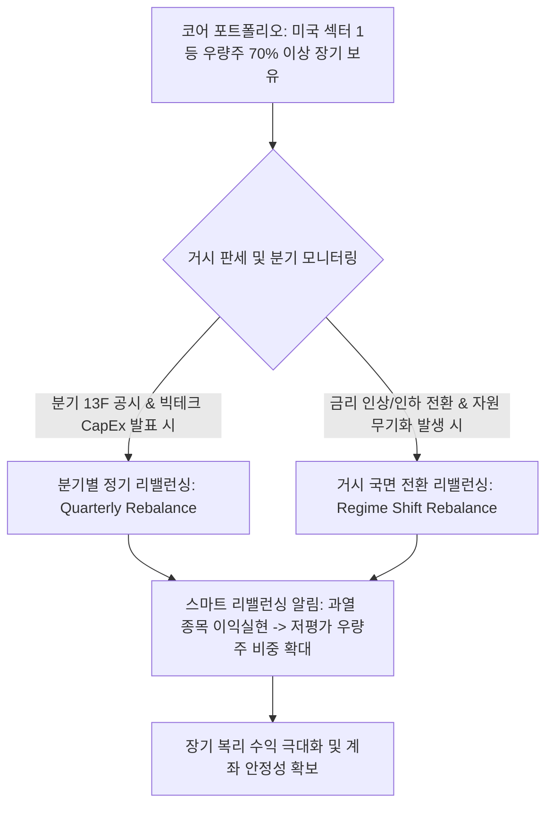

# 📈 [StockLatte] 중장기 우량주 자산배분 & 거시적 리밸런싱 관리 기반 미국 주식 시스템 상세 설계서

> **작성일자:** 2026년 7월 22일 (중장기 코어 보유 & 거시적 리밸런싱 서비스 최종 최적화)  
> **작성자:** 글로벌 미국 주식 수석 트레이더 & AI 시스템 아키텍트  
> **문서 목적:** 잦은 단타 매매로 인한 수수료/세금 손실과 뇌동매매를 완전 차단하고, **미국 섹터 1등 대형 우량주(NVDA, TSLA, MSFT, XOM 등)를 중장기 보유(Buy & Hold)**하면서 거시 경제 판세(금리/CapEx/자원수급/13F 공시) 변화 시 **분기/반기별로 포트폴리오 비중만 '스마트 리밸런싱(Smart Rebalancing)'**하여 최고의 복리 수익과 안정성을 제공하는 자산관리 서비스 구축  

---

## 1. 🎯 프로젝트 개요 및 중장기 투자 철학

### 1.1 "단타 배제 & 중장기 우량주 보유 + 스마트 리밸런싱" 서비스 정체성
* **단타 매매의 치명적 한계 (High Fees & Emotional Trading):** 하루하루 사고파는 단타(Day Trading)는 매매 수수료, 거래세/양도소득세 손실, 슬리피지(Slippage)로 계좌를 녹게 만들며 단기 소음에 휘둘리는 뇌동매매를 유발합니다.
* **미국 주식 시장 최고의 승리 공식 (Long-Term Core Buy & Hold + Rebalancing):**
  - **섹터 1등 우량주 장기 보유:** 강력한 FCF(잉여현금흐름)와 시장 지배력을 가진 NVDA, TSLA, MSFT, AMZN, XOM, CAT 등 코어 우량주를 70% 이상 길게 가져갑니다.
  - **거시적 리밸런싱 (Periodic Macro Rebalancing):** 매일 사고파는 것이 아니라, **분기별(3개월) 실적/13F 공시 발표 시점** 또는 **금리/지정학 국면 전환 시점**에만 비중을 재조정(Rebalancing)합니다.
* **해결책:** 초보 투자자도 불안해하지 않고 편안하게 장기 복리 수익을 누릴 수 있는 **"중장기 우량주 자산배분 & 거시적 리밸런싱 알림 시스템"**을 구축합니다.

---

## 2. 🏛️ 중장기 자산배분 & 거시적 리밸런싱 아키텍처 (Macro Rebalancing Architecture)



---

### 2.1 3대 스마트 리밸런싱 조건 (Smart Rebalancing Rules)

| 리밸런싱 유형 | 발생 주기 및 조건 | 리밸런싱 실행 행동 (Action) |
| :--- | :--- | :--- |
| **1. 분기별 정기 리밸런싱 (Quarterly Rebalancing)** | **매 3개월 (분기 실적 발표 & SEC 13F 공시 완료 시점)** | · 3개월간 펀더멘털 및 빅테크 CapEx 변화 점검<br>· 기관 13F 신규 매수 종목으로 포트폴리오 비중 미세 조정 |
| **2. 거시 국면 전환 리밸런싱 (Macro Regime Shift)** | **금리 전환(Fed Pivot), 전쟁/원자재 폭등, 지정학 위기 발생 시** | · **금리 인하 국면:** 빅테크/AI 성장주 비중 확대 (+15%)<br>· **원자재/지정학 위기 국면:** 방산/에너지 비중 한시적 확대 (+10%) |
| **3. 자산 비중 쏠림 이익확정 (Target Band Rebalancing)** | **특정 우량주 폭등으로 포트폴리오 비중 $35\%$ 초과 시** | · 폭등 종목의 **원금은 두고 이익금 일부만 차익 실현**<br>· 저평가된 타 섹터 1등 우량주로 분산 재투자 (이익 보존) |

---

## 3. 🧠 LLM 주입용 중장기 리밸런싱 진단 프롬프트

사용자의 보유 포트폴리오에 대해 LLM이 중장기 관점에서 리밸런싱 가이드를 제시하는 JSON 구조입니다.

```json
{
  "long_term_portfolio_health": {
    "user_strategy": "Long-Term Core Buy & Hold with Quarterly Rebalancing",
    "holdings": [
      {"ticker": "NVDA", "sector": "Semiconductor", "weight": "42% (과도한 쏠림 ⚠️)", "pnl_pct": "+85.0%"},
      {"ticker": "MSFT", "sector": "Big Tech Software", "weight": "25%", "pnl_pct": "+22.0%"},
      {"ticker": "XOM", "sector": "Energy", "weight": "10%", "pnl_pct": "+8.5%"}
    ]
  },
  "macro_regime_status": {
    "fed_policy": "Interest Rate Cut Expected (금리 인하 국면 진입)",
    "bigtech_capex": "+35% Growth Confirmed",
    "gpr_index": "120 (안정적)"
  },
  "llm_rebalancing_recommendation": {
    "action": "QUARTERLY_REBALANCING_REQUIRED (분기 리밸런싱 권고)",
    "guideline": "1. NVDA 비중이 42%로 과도하게 쏠렸으므로, 이익금의 12%를 차익 실현하여 비중을 30%로 조정하십시오.\n2. 차익 실현한 현금으로 금리 인하 수혜가 기대되는 빅테크/인프라 1등 우량주(MSFT, CAT)로 분산 재투자하여 장기 복리 안전판을 강화하십시오."
  }
}
```

---

## 4. 🌐 올인원 무료 데이터 수집 파이프라인 (All-in-One Data Matrix)

| 분류 | 핵심 지표 / 데이터 | 데이터 출처 (Data Source) | 비용 | 중장기 리밸런싱 시스템 활용 |
| :--- | :--- | :--- | :--- | :--- |
| **1. 기관 매매 & 13F** | **SEC Form 13F 공시<br>기관 지분율 (%)** | **SEC EDGAR API**<br>**yfinance API** | **100% 무료** | · 분기별 워런 버핏/블랙록 매수 종목 확인 후 **분기 리밸런싱** 지표 활용 |
| **2. B2B CapEx & 실적** | **빅테크 CapEx / 10-Q 실적** | **SEC EDGAR API** | **100% 무료** | · 섹터 1등 주도주의 FCF 흑자 지속성 검증 |
| **3. 거시/금리/환율** | **미 기준금리, CPI, DXY, VIX** | **FRED API / yfinance** | **100% 무료** | · 거시 국면 전환(금리 인하/인상) 시 **섹터 비중 리밸런싱** 지표 활용 |
| **4. 주봉/일봉 차트** | **주봉/일봉 50/200 MA 지지선** | **yfinance / `pandas-ta`** | **100% 무료** | · 단기 노이즈를 배제하고 주봉 단위 장기 정배열 확인 |
| **5. 뉴스 & Gemma 요약** | **Google/Yahoo RSS** | **Python `feedparser` / Gemma** | **100% 무료** | · Gemma SLM이 기사 95% 압축 후 전달 |

---

## 5. 🖥️ 초보자를 위한 UI/UX 화면 구성 안 (StockLatte Dashboard)

1. **내 포트폴리오 중장기 건강도 & 리밸런싱 대시보드**
   * `🛡️ 포트폴리오 자산 안전도: 매우 우수 (섹터 1등 우량주 비중 85% / 평균 FCF 흑자 💎)`
   * `🔔 3분기 정기 리밸런싱 알림: NVDA 이익금 10% 차익 실현 ➔ MSFT/CAT 분산 배분 권장`

2. **[NEW] 중장기 코어 포트폴리오 리밸런싱 리포트**
   * **코어 1위 Nvidia (NVDA):** `장기 복리 보유 | 비중 35% 유지 | FCF 압도적 흑자 ➔ 코어 보유 지속`
   * **코어 2위 Microsoft (MSFT):** `장기 복리 보유 | 금리 인하 수혜 ➔ 분기 정기 리밸런싱 비중 확대 (+5%)`
   * **코어 3위 Caterpillar (CAT):** `인프라 리쇼어링 수혜 | 미 건설지출 증가 ➔ 장기 보유`

---

## 6. 🛠️ 단계별 개발 로드맵 (Milestones)

### Phase 1: 중장기 코어 스크리너 & 분기 리밸런싱 엔진 구축 (1주)
* SEC 13F 분기 공시 및 yfinance 기반 1등 우량주 장기 보유 & 포트폴리오 비중 쏠림 감지 알고리즘 구축.

### Phase 2: AI (Gemini) 거시적 리밸런싱 진단 Prompt 연동 (2주)
* 금리 국면 변화 및 분기 실적 발표에 맞춘 중장기 리밸런싱 보고서 자동 생성 Prompt 연동.

### Phase 3: Web Dashboard & 스마트 알림 서비스 구축 (3~4주)
* HTML/Vanilla CSS/JavaScript 기반 중장기 자산관리 및 리밸런싱 알림 대시보드 구축.

---

## 7. 📚 참고 문헌 및 데이터 API (References)

1. **U.S. SEC EDGAR 13F API:** https://www.sec.gov/edgar/sec-api-documentation (분기별 기관 매매 파싱)
2. **FRED (Federal Reserve Economic Data):** https://fred.stlouisfed.org/ (기준금리, CPI, 거시 국면 지표)
3. **Yahoo Finance API (`yfinance`):** https://pypi.org/project/yfinance/ (주봉/일봉 OHLCV, FCF, 펀더멘털)
