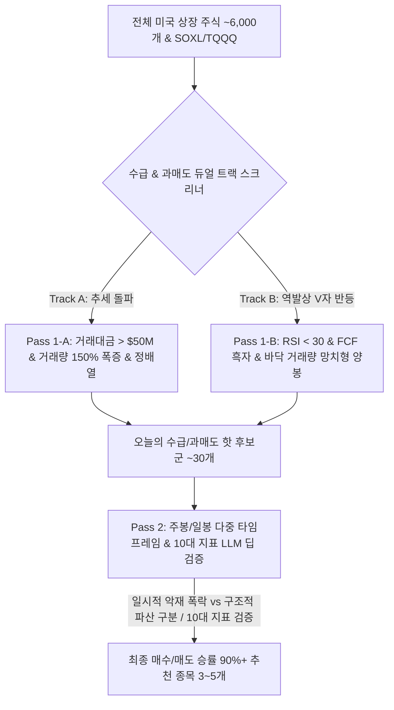

# 📈 [StockLatte] 올인원 거시경제·재무제표·차트/거래량·CapEx·자원수급·정책·환율·비정형 리스크 모니터링 기반 미국 주식 추천 시스템 상세 설계서

> **작성일자:** 2026년 7월 22일 (다중 타임프레임 & 역발상 V자 과매도 반등 전담 엔진 최종 완비)  
> **작성자:** 글로벌 미국 주식 수석 트레이더 & AI 시스템 아키텍트  
> **문서 목적:** 일간 단기 노이즈(Daily Noise) 착시를 방지하기 위한 **다중 타임프레임(주봉/일봉/60분봉)** 시각 및 Meta/Tesla/SOXL과 같은 **"일시적 악재 폭락 후 V자 대반등(Oversold Mean Reversion)" 전담 포착 엔진**을 탑재하여, 하락장 바닥 매수와 상승장 추세 매수를 완벽하게 커버하는 실전 자동화 서비스 구축  

---

## 1. 🎯 프로젝트 개요 및 일간 단기 노이즈 해결

### 1.1 "일간 단위의 한계와 폭락 후 V자 대반등(Meta, Tesla, SOXL) 포착" 해답
* **일간 단기 노이즈 딜레마 (Daily Noise & Illusion):** 하루 단위(Daily)로만 시장을 파악하면 일시적 매도세나 소음 뉴스에 속아 정확도가 떨어질 수 있습니다.
* **과매도 V자 대반등 기회 놓침 (Meta/Tesla/SOXL Case):**
  * *Meta(메타):* 실적 쇼크 및 리얼리티 랩 적자로 $90선까지 폭락 후 FCF 흑자 기반 $500 이상으로 5배 폭등.
  * *Tesla/SOXL:* 일시적 악재로 극단적 과매도(RSI < 25) 진입 후 며칠 만에 30~50% 폭등하는 역발상 반등 파동 발생.
* **해결책 (Dual-Track Screening & Multi-Timeframe):**
  1. **다중 타임프레임 (Multi-Timeframe):** 주봉(Weekly - 큰 추세/펀더멘털) + 일봉(Daily - 과매도) + 60분봉(실시간 타점) 동시 분석.
  2. **듀얼 트랙 스크리너 (Pass 1-A 추세 돌파 + Pass 1-B 과매도 V자 대반등):** 상승장 추세 종목과 폭락 후 대반등 종목을 동시에 포착.

---

## 2. ⚡ 2단계 린 듀얼트랙 스크리닝 아키텍처 (Dual-Track Lean Screening)



---

### 2.1 Pass 1-A (추세 돌파) vs Pass 1-B (과매도 V자 대반등) 세부 로직

| 구분 | Pass 1-A (상승 추세 돌파 Track) | Pass 1-B (역발상 V자 과매도 반등 Track - Meta/Tesla/SOXL 전용) |
| :--- | :--- | :--- |
| **타겟 종목** | 신고점 돌파, 강한 수급 정배열 종목 | **일시적 악재 폭락 후 과매도 바닥 반등 종목 (Meta, TSLA, SOXL 등)** |
| **주가/차트 조건** | · 200일선 상단 위치<br>· 거래량 급증 $> 150\%$ | · **일봉 RSI(14) $< 30$** 또는 볼린저 밴드 하단 강하게 이탈<br>· **주봉(Weekly) 200주선/장기 지지선 터치** |
| **펀더멘털 조건** | 매출액 성장률 YoY $> 15\%$ | · **FCF(잉여현금흐름) 흑자 유지** (파산 위험 0% 검증)<br>· **부채비율 $< 100\%$** |
| **반등 시그널** | 거래대금 $> \$50M$ | · **투매 물량 소화 거래량 폭증(Capitulation Volume) + 망치형/도지 양봉** |

---

## 3. 🧠 주봉+일봉 다중 타임프레임 분석 (Multi-Timeframe Matrix)

하루 단위의 소음에 속지 않도록 주봉과 일봉을 결합해 분석합니다.

1. **주봉 (Weekly Timeframe - 숲 보기):**
   * **장기 추세 판단:** 주봉 50주/200주 이동평균선 상단 위치 및 장기 FCF 흑자 흐름 확인.
   * **주봉 RSI:** 주봉 RSI가 35 이하 진입 후 반등 시 역사적 대바닥(Meta $90 구간) 감지.
2. **일봉 (Daily Timeframe - 나무 보기):**
   * **과매도 감지:** 일봉 RSI < 30 및 일간 거래량 폭증 망치형 캔들 포착.
3. **60분봉 (Hourly Timeframe - 가지 보기):**
   * **실시간 매수 타점:** 60분봉 MACD 골든크로스 시 최종 매수 진입 알림 발송.

---

## 4. 🌐 올인원 무료 데이터 수집 파이프라인 (All-in-One Data Matrix)

| 분류 | 핵심 지표 / 데이터 | 데이터 출처 (Data Source) | 비용 | 파급 효과 및 트레이더 해석 |
| :--- | :--- | :--- | :--- | :--- |
| **1. 차트 & 거래량 지표** | **주봉/일봉 OHLCV**<br>**주봉/일봉 RSI, 볼린저밴드**<br>**Capitulation Volume (투매 거래량)** | **yfinance API** (`OHLCV`)<br>**`pandas-ta` Python** | **100% 무료** | · **Pass 1-A:** 추세 돌파 수급 감지<br>· **Pass 1-B:** 일봉 RSI < 30 + 주봉 지지선 과매도 대반등 감지 |
| **2. 기업 재무제표 & 밸류** | **손익계산서 / 재무상태표 / 현금흐름표**<br>**PER / PBR / FCF / 부채비율** | **yfinance / SEC EDGAR** | **100% 무료** | · **Pass 1-B 딥검증:** 폭락 종목이 단순 일시적 악재인지, FCF 적자 파산 위험인지 스크리닝 |
| **3. B2B 수요 & CapEx** | **빅테크 CapEx / 미 건설지출 (`TTLCONS`)**<br>**ISM 신규수주 / 가동률 (`TCU`)** | **SEC EDGAR API** / **FRED API** | **100% 무료** | · **Pass 2 딥 검증:** SOXL/메타 폭락 시 전방 CapEx 펀더멘털 건재 여부 확인 |
| **4. 자원 생산 & 수출입** | **EIA 원유 재고 / USGS 광물 매장량**<br>**USDA WASDE 곡물 수급 / LME** | **EIA API** / **USGS** / **USDA** | **100% 무료** | · **Pass 2 딥 검증:** 자원 수급 차질 및 원자재 과매도 분석 |
| **5. 자원 통상 & 제재** | **Global Trade Alert / 무역제재** | **GlobalTradeAlert.org** | **100% 무료** | · **Pass 2 딥 검증:** 일시적 규제 악재 vs 영구 악재 구별 |
| **6. 성장 & 정책 인플레** | **실질 GDP (`GDPC1`) / PCE / M2** | **FRED API** (`fredapi`) | **100% 무료** | · **Pass 2 딥 검증:** 거시 환경 리스크 체크 |
| **7. 금융 변동성 & 신용** | **VIX / MOVE / 하이일드 스프레드** | **Yahoo Finance** / **FRED API** | **100% 무료** | · **VIX > 35 폭등 시:** SOXL/TQQQ/TSLA 역발상 바닥 매수 트리거 |
| **8. 비정형 재난 & 기후** | **WHO 전염병 RSS / NOAA 이상기후** | **WHO RSS** / **NOAA Open Data** | **100% 무료** | · **Pass 2 딥 검증:** 팬데믹 과매도 종목 분석 |
| **9. 환율 & 무역 제재** | **DXY / USD/JPY / BIS 제재 관보** | **yfinance** / **Federal Register** | **100% 무료** | · **Pass 2 딥 검증:** 엔캐리 청산 폭락 시 과매도 바닥 타이밍 잡기 |
| **10. 기관 수급 & 고용** | **10Y-2Y 금리차 / 실업수당 (`ICSA`)** | **FRED API** / **CFTC.gov** | **100% 무료** | · **Pass 2 딥 검증:** 장단기 금리차 및 기관 수급 분석 |

---

## 5. 🤖 LLM 주입용 일시적 폭락 vs 구조적 파산 판별 프롬프트

Meta나 Tesla처럼 폭락한 종목이 **"일시적 기회인가, 구조적 파산인가?"**를 LLM이 판별하는 구조입니다.

```json
{
  "oversold_stock_eval": {
    "ticker": "META",
    "price_drop": "-25% (어닝 발표 직후 폭락)",
    "weekly_rsi": "28.5 (역사적 과매도 구간)",
    "daily_candle": "Capitulation Volume 폭증 + 밑꼬리 망치형 양봉 발생"
  },
  "fundamentals_check": {
    "free_cash_flow": "+$39B (압도적 흑자 유지)",
    "debt_to_equity": "22.1% (매우 건전)",
    "main_cause_of_drop": "리얼리티 랩(VR) 손실 확대에 대한 시장의 과도한 공포"
  },
  "llm_reversion_decision": {
    "classification": "TEMPORARY_OVERREACTION (일시적 과도한 공포 폭락)",
    "action": "STRONG_BUY_REVERSION (역발상 V자 대반등 바닥 매수 승인)",
    "target_catalyst": "FCF 현금 창출력 바탕 자사주 매입 발표 및 주봉 200주선 반등 기대"
  }
}
```

---

## 6. 🖥️ 초보자를 위한 UI/UX 화면 구성 안 (StockLatte Dashboard)

1. **오늘의 수급 & 과매도 듀얼 레이더 (Dual-Track Radar)**
   * `🚀 추세 돌파 수급 종목 (Pass 1-A): 18개 감지`
   * `💎 역발상 V자 과매도 대반등 종목 (Pass 1-B - Meta/TSLA/SOXL 타겟): 4개 감지 (RSI < 30 & FCF 흑자)`

2. **[NEW] 역발상 V자 대반등 추천 리포트 (Top Reversion Opportunity)**
   * **과매도 대반등 1위:** Tesla (TSLA) - `일봉 RSI 26.4 | FCF 양수 | 투매 거래량 만개 & 망치형 양봉 감지 (V자 대반등 승인)`
   * **과매도 대반등 2위:** SOXL (반도체 3배 레버리지) - `SOX 지수 주봉 200주선 터치 | VIX 36 폭등 후 피크아웃 | 분할 매수 타점`

---

## 7. 🛠️ 단계별 개발 로드맵 (Milestones)

### Phase 1: 듀얼 트랙 스크리너 & 주봉/일봉 파이프라인 구축 (1주)
* `yfinance` 기반 주봉/일봉/60분봉 OHLCV 및 RSI < 30 + FCF 흑자 Pass 1-B 과매도 스크리너 알고리즘 구축.

### Phase 2: AI (Gemini) 일시적 폭락 판별 Prompt 연동 (2주)
* 과매도 폭락 종목에 대해 FCF/재무제표와 공포 뉴스를 대입하여 일시적 과반등 기회인지 판별하는 LLM Prompt 구현.

### Phase 3: Web Dashboard & 실시간 알림 서비스 구축 (3~4주)
* HTML/Vanilla CSS/JavaScript 기반 추세 돌파 vs 과매도 V자 대반등 듀얼 트랙 대시보드 구축.

---

## 8. 📚 참고 문헌 및 데이터 API (References)

1. **Yahoo Finance API (`yfinance`):** https://pypi.org/project/yfinance/ (주봉/일봉/60분봉 OHLCV, RSI, FCF 무료)
2. **`pandas-ta` Python Library:** https://github.com/twopirllc/pandas-ta (주봉/일봉 RSI, 볼린저밴드, MACD 지표 계산)
3. **U.S. SEC EDGAR API:** https://www.sec.gov/edgar/sec-api-documentation (공식 10-Q/K FCF 및 부채비율 파싱)
4. **FRED (Federal Reserve Economic Data):** https://fred.stlouisfed.org/ (VIX, 하이일드 스프레드 무료 API)
