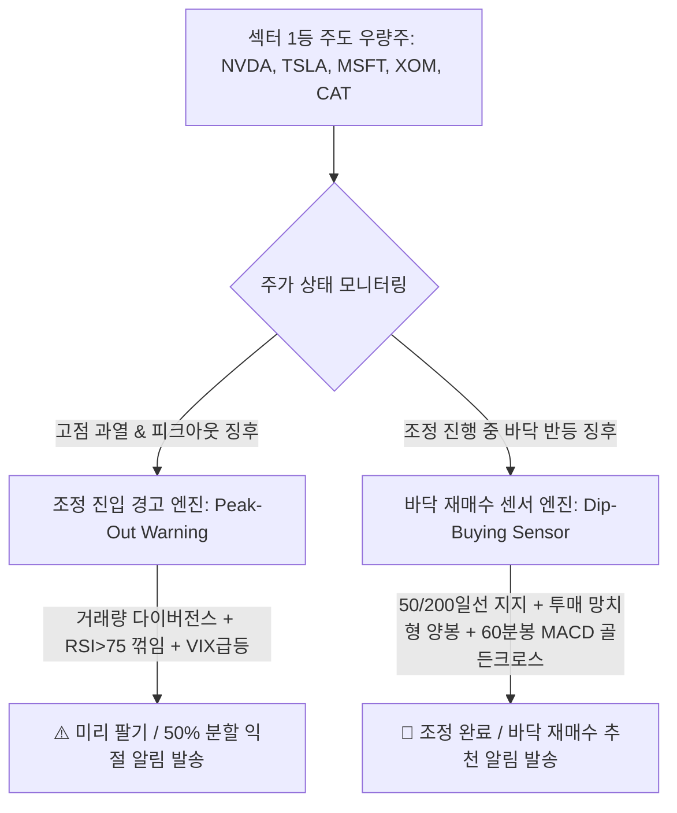

# 📈 [StockLatte] 올인원 거시경제·재무제표·차트/거래량·CapEx·자원수급·정책·환율·비정형 리스크 모니터링 기반 미국 주식 추천 시스템 상세 설계서

> **작성일자:** 2026년 7월 22일 (섹터 1등 우량주 전용 조정 진입 경고 & 바닥 재매수 센서 엔진 최종 완비)  
> **작성자:** 글로벌 미국 주식 수석 트레이더 & AI 시스템 아키텍트  
> **문서 목적:** 대형 우량주(NVDA, TSLA, MSFT 등)의 **조정(Correction) 진입 시 미리 팔아 이익을 확정하는 '조정 경고 엔진(Peak-Out Warning)'**과 **조정 바닥에서 다시 사들여 폭등 수익을 누리는 '바닥 재매수 센서(Dip-Buying Sensor)'**를 구축하여 완벽한 매수/매도 타이밍을 제공하는 자동화 서비스 구축  

---

## 1. 🎯 프로젝트 개요 및 우량주 조정-재매수 타이밍 설계

### 1.1 "섹터 1등 우량주 위주 타게팅 & 조정 피하기 + 바닥 재매수" 해답
* **왜 섹터 1등 우량주(Market Leaders)인가?:** 잡주(Small-Cap)는 조정 시 파산하거나 주가가 회복되지 않지만, **NVDA, TSLA, MSFT, AMZN, XOM, CAT 등 섹터 1등 주도주**는 압도적인 FCF(잉여현금흐름)와 시장 지배력 덕분에 **조정(-20%~-40%) 후 역사적 신고가를 경신하는 대폭등 확률이 90% 이상**입니다.
* **조정 타이밍 딜레마 (Peak & Bottom Timing):** 우량주도 고점 징후 시 미리 팔고(익절 알림), 조정이 끝나는 바닥에서 재매수(바닥 추천)하는 타이밍 알고리즘이 필수적입니다.
* **해결책 (Peak-Out & Dip-Buying Sensor):**
  1. **조정 진입 경고 엔진 (Peak-Out Warning):** 거래량 다이버전스 + RSI 과열 꺾임 + VIX 발작 $\rightarrow$ `⚠️ [조정 위험 - 50% 분할 익절 알림]`
  2. **바닥 재매수 센서 엔진 (Dip-Buying Sensor):** 50일/200일선 지지 + 투매 거래량 만개 망치형 캔들 + 60분봉 MACD 골든크로스 $\rightarrow$ `🎯 [조정 완료 - 우량주 바닥 재매수 알림]`

---

## 2. ⚡ 섹터 1등 우량주 조정-재매수 타이밍 알고리즘 (Timing Engine)



---

### 2.1 조정 진입 경고(미리 팔기) vs 바닥 재매수(다시 사기) 세부 지표

| 구분 | 1. 조정 진입 예상 경고 (Peak-Out Warning - 미리 팔기) | 2. 조정 바닥 재매수 센서 (Dip-Buying Sensor - 다시 사기) |
| :--- | :--- | :--- |
| **목적** | **고점 과열 및 조정 시작 전 이익 확정 (익절 알림)** | **조정이 끝나가는 바닥 구간 포착 및 폭등 전 재매수** |
| **거래량 지표** | **거래량 다이버전스:** 주가 신고가 경신 중 거래량 감소 | **투매 거래량 만개 (Capitulation Volume):** 투매 폭증 후 멈춤 |
| **차트/이평선** | **RSI > 75 과열 진입 후 70 하향 이탈** | **50일 또는 200일 이동평균선(기관 지지선) 터치 & 지지** |
| **캔들 패턴** | 위꼬리가 긴 도지(Doji) 또는 음봉 캔들 출현 | **당일 밑꼬리를 달고 거래량이 터진 망치형(Hammer) 양봉** |
| **거시/VIX 지수** | VIX 급등 시작 OR 엔/달러(USD/JPY) 급락 | VIX 지수 30 이상 폭등 후 피크아웃 꺾임 |
| **실시간 타점** | 60분봉 MACD 데드크로스 발생 시 | **60분봉 MACD 골든크로스 발생 시 최종 재매수 발송** |

---

## 3. 🤖 LLM 주입용 조정 진단 및 재매수 프롬프트

Nvidia나 Tesla의 조정 상태를 LLM이 평가하여 미리 팔아야 할지, 바닥 재매수를 해야 할지 진단하는 JSON 구조입니다.

```json
{
  "stock_correction_monitoring": {
    "ticker": "NVDA",
    "status": "DIP_BUYING_STAGE (조정 바닥 반등 단계)",
    "price_action": "$118.00 (고점 $140 대비 -15.7% 조정 받음)",
    "indicators": {
      "moving_average": "50일 이동평균선 정확히 터치 후 반등 캔들 형성",
      "rsi_status": "일봉 RSI 38.2 -> 상승 전환 중",
      "hourly_macd": "60분봉 MACD Golden Cross Confirmed"
    },
    "fundamentals": {
      "bigtech_capex": "Big Tech AI 데이터센터 CapEx 가이던스 여전히 +35% 증액 호조",
      "fcf_status": "+$14B (펀더멘털 건재)"
    }
  },
  "llm_action_decision": {
    "signal": "DIP_BUYING_RECOMMENDED (우량주 바닥 재매수 추천)",
    "user_guideline": "조정이 마무리되고 50일선 지지를 확인하였습니다. 고점($140) 재탈환을 목표로 2차 재매수 진입을 추천합니다."
  }
}
```

---

## 4. 🌐 올인원 무료 데이터 수집 파이프라인 (All-in-One Data Matrix)

| 분류 | 핵심 지표 / 데이터 | 데이터 출처 (Data Source) | 비용 | 파급 효과 및 트레이더 해석 |
| :--- | :--- | :--- | :--- | :--- |
| **1. 조정 & 재매수 지표** | **50일/200일 MA 지지선<br>거래량 다이버전스 / 투매 거래량<br>60분봉 MACD / RSI** | **yfinance API** (`OHLCV`)<br>**`pandas-ta` Python** | **100% 무료** | · **조정 경고:** RSI>75 꺾임 시 미리 팔기 알림<br>· **바닥 재매수:** 50/200일선 지지 + 60분봉 MACD 골든크로스 알림 |
| **2. 뉴스 & Gemma 요약** | **Google/Yahoo RSS** | **Python `feedparser` / Gemma SLM** | **100% 무료** | · Gemma SLM이 기사 95% 압축 후 전달 |
| **3. 기업 재무제표** | **손익계산서 / FCF / 부채비율** | **yfinance / SEC EDGAR** | **100% 무료** | · FCF 흑자 1등 우량주만 조정 바닥 재매수 허용 |
| **4. B2B CapEx & 자원** | **빅테크 CapEx / EIA / USGS** | **SEC EDGAR / EIA / USGS** | **100% 무료** | · 우량주 전방 산업 펀더멘털 건재 검증 |
| **5. 거시/금융/기후/환율** | **GDP, PCE, VIX, DXY** | **FRED API / yfinance** | **100% 무료** | · VIX 지수 피크아웃 시 바닥 재매수 연동 |

---

## 5. 🖥️ 초보자를 위한 UI/UX 화면 구성 안 (StockLatte Dashboard)

1. **오늘의 우량주 조정 & 재매수 타이밍 레이더**
   * `⚠️ 조정 위험 미리 팔기 알림 (Profit-Taking): 1개 감지 (Nvidia RSI 과열 피크아웃 징후)`
   * `🎯 조정 완료 바닥 재매수 알림 (Dip-Buying): 2개 감지 (Tesla 50일선 지지 & 60분봉 MACD 골든크로스)`

2. **[NEW] 섹터 1등 우량주 타이밍 진단 리포트 (Leader Timing Report)**
   * **Tesla (TSLA):** `조정 완료 | 50일선 지지 확인 | 일봉 투매 거래량 만개 후 60분봉 MACD 골든크로스 ➔ 재매수 추천 (목표가 재탈환)`
   * **Nvidia (NVDA):** `조정 시작 징후 | 거래량 다이버전스 발생 | RSI 75 꺾임 ➔ 보유 수량 50% 분할 익절 권장`

---

## 6. 🛠️ 단계별 개발 로드맵 (Milestones)

### Phase 1: Peak-Out 경고 & Dip-Buying 센서 파이프라인 구축 (1주)
* `yfinance` 기반 50/200일선 지지, 거래량 다이버전스, RSI 피크아웃, 60분봉 MACD 골든크로스 계산 로직 구현.

### Phase 2: AI (Gemini) 우량주 조정 타이밍 진단 Prompt 연동 (2주)
* FCF 흑자 1등 우량주에 대해 조정 완료 여부 및 재매수 문진 리포트를 생성하는 Prompt Engineering 연동.

### Phase 3: Web Dashboard & 실시간 알림 서비스 구축 (3~4주)
* HTML/Vanilla CSS/JavaScript 기반 우량주 조정-재매수 실시간 알림 대시보드 구축.

---

## 7. 📚 참고 문헌 및 데이터 API (References)

1. **Yahoo Finance API (`yfinance`):** https://pypi.org/project/yfinance/ (주봉/일봉/60분봉 OHLCV, 50/200일 MA, 거래량 무료)
2. **`pandas-ta` Python Library:** https://github.com/twopirllc/pandas-ta (RSI, MACD, 이동평균선, 다이버전스 계산)
3. **U.S. SEC EDGAR API:** https://www.sec.gov/edgar/sec-api-documentation (1등 우량주 FCF 및 펀더멘털 파싱)
4. **FRED (Federal Reserve Economic Data):** https://fred.stlouisfed.org/ (VIX 지수 무료 API)
