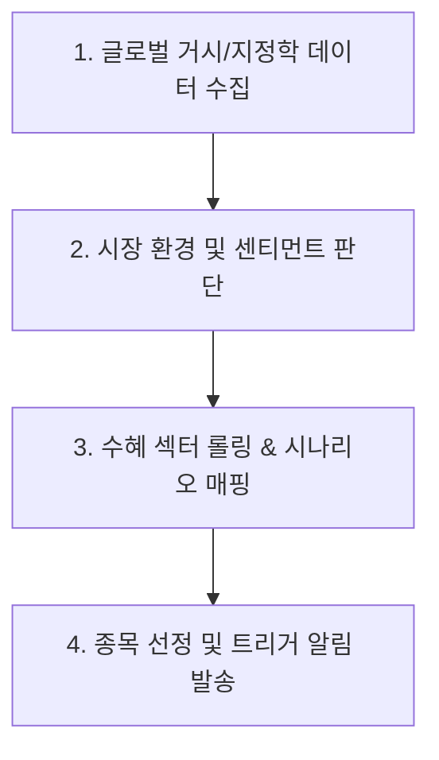

# 📈 [StockLatte] 글로벌 거시경제 및 지정학 리스크 모니터링 기반 미국 주식 추천 시스템 기획 제안서

> **작성일자:** 2026년 7월 22일  
> **작성자:** 글로벌 미국 주식 수석 트레이더 & AI 시스템 아키텍트  
> **문서 목적:** 경제 초보자도 매일 세계 경제/전쟁 상황을 한눈에 파악하고, 명확한 트리거 조건에 맞춰 미국 주식 투자 기회를 포착할 수 있는 자동화 추천 서비스 설계  

---

## 1. 🎯 프로젝트 개요 및 배경

### 1.1 배경 및 문제 정의
* **정보의 과부하 (Information Overload):** 매일 쏟아지는 글로벌 뉴스, FOMC 금리 발표, CPI 인플레이션 지수, 중동/유럽 전쟁 소식, 공급망 이슈 등 수많은 자료를 개인이 매일 분석하는 것은 불가능에 가깝습니다.
* **경제 지식 진입 장벽:** 일반 투자자는 "유가가 오르면 왜 특정 주가가 오르는가?", "금리가 인하되면 어떤 섹터가 수혜를 받는가?"와 같은 **인과관계(Causality)** 및 **매수 적기(Catalyst/Trigger)**를 판단하기 어렵습니다.
* **해결책:** 복잡한 거시경제(Macro) 및 지정학(Geopolitics) 데이터를 AI가 실시간으로 수집·분석하여, 초보 투자자도 10초 만에 이해할 수 있는 **"추천 종목 + 추천 사유 + 주가 상승 트리거 조건 + 리스크 요인"**을 자동 생성해주는 서비스를 구축합니다.

---

## 2. 🧠 전문 트레이더 관점의 핵심 분석 프레임워크 (Top-Down Approach)

전문 트레이더는 나무(개별 종목)보다 숲(글로벌 거시 경제 및 지정학 판세)을 먼저 봅니다. 본 서비스는 다음 **4단계 Top-Down 분석 체계**를 따릅니다.



### 2.1 주요 데이터 모니터링 지표 매핑

| 카테고리 | 핵심 모니터링 지표 | 트레이더 시각 (의미 분석) | 수혜 섹터/종목 예시 |
| :--- | :--- | :--- | :--- |
| **지정학 (Geopolitics)** | GPR Index (지정학 리스크 지수), 전쟁 뉴스, 호르무즈/대만 해협 긴장도 | 공급망 차단, 원자재 가격 폭등, 국방 예산 증액 | **방산:** LMT, RTX, PLTR<br>**에너지:** XOM, CVX |
| **원자재 (Commodities)** | WTI 원유, 천연가스, 금(Gold), 원자재 지수 | 인플레이션 재발 우려, 안전자산 선호 심리 | **안고자산:** GLD, NEM<br>**에너지:** OXY, VLO |
| **통화/금리 (Macro/Fed)** | 미 연준 기준금리, 점도표(Dot Plot), CPI, DXY (달러 인덱스) | 유동성 환경, 할인율 변화, 성장주 vs 가치주 향방 | **기술/성장주:** NVDA, MSFT, AAPL<br>**금융:** JPM |
| **공급망/반도체** | 대만 긴장 지수, 칩스법(CHIPS Act), 반도체 리드타임 | 글로벌 IT 파운드리 공급 차질 및 대체 생산지 부각 | **미국 내 반도체:** INTEL, AMAT, Micron |

---

## 3. ⚙️ 서비스 핵심 기능 및 알림 메커니즘 (Scenario & Trigger Engine)

본 서비스의 핵심은 **"단순 뉴스 전달"이 아니라 "조건부 주가 상승 시나리오(If-Then Trigger)"**를 제시하는 것입니다.

### 3.1 💡 주가 상승 시나리오 및 트리거 예시 (If-Then Engine)

#### 시나리오 A: 중동 지정학적 긴장 고조 및 유가 상방 돌파
* **상황 조건 (IF):** 중동 지역 분쟁 격화 뉴스 급증 AND WTI 원유 가격 $\$85/bbl$ 돌파.
* **주가 상승 메커니즘 (WHY):** 유가 상승으로 원유 시프링 및 정제 마진 급증, 글로벌 석유 공룡 기업들의 이익 전망치(EPS) 상향 조정.
* **추천 종목:** **Exxon Mobil (XOM)**, **Chevron (CVX)**
* **상승 트리거 (WHEN TO BUY):** WTI 원유 $\$85$ 확정 종가 상회 시 매수 모멘텀 발동.
* **위험 요인 (RISK):** OPECS+ 증산 합의 또는 평화 협정 타결 시 급락 위험.

#### 시나리오 B: 미 연준(Fed) 금리 인하 전환 (Pivot) 및 인플레이션 둔화
* **상황 조건 (IF):** CPI 전년 대비 상승률 $< 3.0\%$ AND 10년물 국채 금리 하락세.
* **주가 상승 메커니즘 (WHY):** 할인율 하락으로 미래 성장 가치가 높은 Big Tech 및 AI 반도체 기업의 밸류에이션 재평가(Multiple Expansion).
* **추천 종목:** **Nvidia (NVDA)**, **Microsoft (MSFT)**
* **상승 트리거 (WHEN TO BUY):** FOMC 금리 인하 발표 또는 CPI 예상치 하회 직후.
* **위험 요인 (RISK):** 경기 침체(Recession) 우려로 인한 실적 둔화.

#### 시나리오 C: 신냉전 구도 심화 및 국방비 지출 확대
* **상황 조건 (IF):** 미국 및 NATO 동맹국 국방 예산 전년 대비 $5\%$ 이상 증액 뉴스.
* **주가 상승 메커니즘 (WHY):** 미사일, 방공망, AI 기반 감시 체계 수주 잔고(Backlog) 급증.
* **추천 종목:** **Lockheed Martin (LMT)**, **Palantir (PLTR)**
* **상승 트리거 (WHEN TO BUY):** 국방 예산안 의회 통과 또는 분쟁 발생 초기.

---

## 4. 📐 시스템 아키텍처 (System Architecture)

```
 [외부 데이터 원천]
 ├── News & Geopolitics (RSS / GPR / Web Crawling)
 ├── Financial Data (FRED API / Yahoo Finance / Alpha Vantage)
 └── Fed Watch & Inflation Data
        │
        ▼
 [Data Ingestion & Preprocessing Layer]
        │
        ▼
 [AI Analysis & NLP Engine (LLM)]
 ├── 지정학 리스크 점수 산출 (0 ~ 100)
 ├── 센티먼트 분석 (Bullish / Neutral / Bearish)
 └── 핵심 3줄 요약 및 인과 관계 추출
        │
        ▼
 [Rule & Trigger Engine]
 ├── If-Then 시나리오 매칭
 └── 매수 모멘텀 센서 동작
        │
        ▼
 [StockLatte UI / Notification System]
 ├── 오늘의 시장 온도계 대시보드
 ├── 종목별 추천 리포트 (이유 + 상승 타이밍)
 └── 텔레그램 / Discord / 웹 푸시 알림
```

---

## 5. 🖥️ 초보자를 위한 UI/UX 화면 구성 안 (StockLatte Dashboard)

1. **오늘의 글로벌 시장 온도계 (Market Thermometer)**
   * `🔴 지정학 리스크: 높음 (중동 유가 변동성 ⚠️)`
   * `🟢 금리 환경: 중립 (FOMC 대기 중 ⏳)`
   * `오늘의 추천 키워드: #에너지 #방산 #안전자산`

2. **종목 추천 카드 (Recommendation Card)**
   * **종목명:** 엑손모빌 (Exxon Mobil, Ticker: XOM)
   * **추천 등급:** ⭐⭐⭐⭐☆ (매수 모멘텀 임박)
   * **왜 좋은가? (3줄 요약):**
     1. 중동 분쟁 심화로 원유 공급 차질 우려 증가.
     2. 유가 $\$85$ 돌파 시 잉여현금흐름(FCF) 급증으로 자사주 매입 확대 예상.
     3. 배당 수익률 $3.3\%$로 하방 지지력 탄탄.
   * **언제 가격이 오르는가? (상승 카탈리스트):**
     * WTI 원유 주봉 기준 $\$85$ 상방 돌파 시 추가 10~15% 상승 모멘텀 발생.
   * **주의할 점 (리스크):**
     * 종전 협상 타결 시 단기 차익 실현 물량 출회 가능성.

---

## 6. 🛠️ 단계별 개발 로드맵 (Milestones)

### Phase 1: MVP 수집 및 스크립트 개발 (1~2주)
* Python 기반 뉴스 및 주요 거시 지표(유가, VIX, 금리) 수집 파이프라인 구축 (`yfinance`, `FRED API`).
* 거시 지표 룰 기반 종목 추천 알고리즘 작성 (`tests/` 및 `test_results/` 환경 구축).

### Phase 2: AI (LLM) 기반 분석 Engine 연동 (2~3주)
* Gemini API 또는 Open-source LLM을 연동하여 뉴스 감성 분석 및 지정학 리스크 점수 자동 산출.
* "왜 좋은지", "어떨 때 오르는지" 문장 자동 생성 Prompt Engineering 적용.

### Phase 3: Web Dashboard & 알림 서비스 구축 (3~4주)
* HTML/Vanilla CSS/JavaScript (또는 Vite React) 기반의 직관적이고 현대적인 UI 개발.
* 매일 아침 브리핑 알림 기능 연동.

---

## 7. 📚 참고 문헌 및 데이터 API (References)

1. **FRED (Federal Reserve Economic Data):** https://fred.stlouisfed.org/ (미국 금리, 인플레이션 데이터)
2. **Yahoo Finance API (yfinance):** https://pypi.org/project/yfinance/ (미국 주식 및 원자재 시세 데이터)
3. **Geopolitical Risk (GPR) Index:** https://www.matteoiacoviello.com/gpr.htm (지정학 리스크 지수 데이터)
4. **U.S. Energy Information Administration (EIA):** https://www.eia.gov/ (원유 공급 및 유가 통계)
